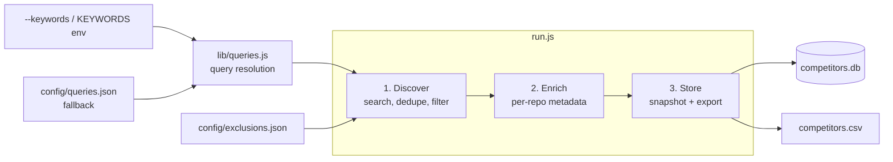

<div align="center">

# GitHub Prospecting

**Automated discovery and tracking of GitHub repositories in a target market.**

Search, enrich, snapshot. Watch a competitive landscape evolve over time and catch new entrants the day they appear.


</div>

---

## Table of contents

- [Overview](#overview)
- [Results](#results)
- [How it works](#how-it-works)
- [Quick start](#quick-start)
- [Usage](#usage)
  - [Full pipeline](#full-pipeline)
  - [Fast mode](#fast-mode-discover-only)
- [Configuration](#configuration)
- [Data model](#data-model)
- [Project layout](#project-layout)
- [Rate limits](#rate-limits)
- [Troubleshooting](#troubleshooting)

## Overview

GitHub Prospecting is a small, dependency-light Node.js pipeline for competitive intelligence on GitHub. Point it at **any market segment** with `--keywords "your, terms"` — queries are generated automatically — or hand-tune a query list for precision (the repo ships with a tuned list targeting the **AI agent / LLM memory** space as a working example). Then run it on a schedule. Each run:

1. Discovers every public repository matching your queries
2. Enriches each candidate with deep metadata (activity, contributors, releases, README)
3. Persists a **dated snapshot** to SQLite and exports a star-ranked CSV

Because every run is a snapshot keyed by date, the database becomes a time series: you can chart star growth, spot momentum shifts, and get an explicit list of repos that are **new since the last run**.

**Design principles**

- **Config over code.** Retargeting to a different market is one `--keywords` flag; deeper tuning (queries, thresholds, exclusions) lives in three JSON files. Zero code changes either way.
- **Degrade, never abort.** A failed endpoint yields a `null` field, not a crashed run. Long runs survive rate limits by sleeping until the limit resets.
- **One dependency.** `better-sqlite3` for storage. Everything else is Node.js built-ins.

## Results

Latest snapshot (2026-07-09) — 279 repositories, ranked by stars. Regenerated from `competitors.csv` after each run.

<details>
<summary><strong>Full results table (279 repos)</strong></summary>

| # | Repository | Stars | Language | Last push | Description | Topics | Website | Discovered via |
| ---: | --- | ---: | --- | --- | --- | --- | --- | --- |
| 1 | [langfuse/langfuse](https://github.com/langfuse/langfuse) | 30,764 | TypeScript | 2026-07-08 | 🪢 Open source AI engineering platform: LLM evals, observability, metrics, prompt management, playground, datasets. Integrates with OpenTelemetry, LangChain, OpenAI SDK, LiteLLM, and more. 🍊YC W23 | analytics; autogen; evaluation; langchain; large-language-models; llama-index; llm; llm-evaluation; llm-observability; llmops; monitoring; observability; open-source; openai; playground; prompt-engineering; prompt-management; self-hosted; ycombinator | [langfuse.com](https://langfuse.com) | `topic:llm-observability` |
| 2 | [comet-ml/opik](https://github.com/comet-ml/opik) | 20,442 | Python | 2026-07-09 | Debug, evaluate, and monitor your LLM applications, RAG systems, and agentic workflows with comprehensive tracing, automated evaluations, and production-ready dashboards. | evaluation; hacktoberfest; hacktoberfest2025; langchain; llama-index; llm; llm-evaluation; llm-observability; llmops; open-source; openai; playground; prompt-engineering | [www.comet.com/docs/opik](https://www.comet.com/docs/opik/) | `topic:llm-observability` |
| 3 | [openobserve/openobserve](https://github.com/openobserve/openobserve) | 19,784 | TypeScript | 2026-07-09 | Open source observability platform for logs, metrics, traces, frontend monitoring, pipelines and LLM observability. A sophisticated, simple and highly performant alternative to Datadog, Splunk, and Elasticsearch with 140x lower storage costs and single binary deployment. | analytics; apm; datadog; elasticsearch; grafana; jaeger; kibana; log-analytics; log-management; log-search; logs; metrics; monitoring; observability; openobserve; opentelemetry; prometheus; rust-lang; splunk; traces | [openobserve.ai](https://openobserve.ai) | `"llm observability" in:description` |
| 4 | [VoltAgent/voltagent](https://github.com/VoltAgent/voltagent) | 9,995 | TypeScript | 2026-07-09 | AI Agent Engineering Platform built on an Open Source TypeScript AI Agent Framework | agents; ai; ai-agents; ai-agents-framework; aiagentframework; chatbots; chatgpt; framework; javascript; llm; llm-observability; mcp; multiagent; nodejs; observability; open-source; openai; rag; tts; typescript | [voltagent.dev](https://voltagent.dev) | `topic:llm-observability` |
| 5 | [evidentlyai/evidently](https://github.com/evidentlyai/evidently) | 7,673 | Jupyter Notebook | 2026-05-02 | Evidently is ​​an open-source ML and LLM observability framework. Evaluate, test, and monitor any AI-powered system or data pipeline. From tabular data to Gen AI. 100+ metrics. | data-drift; data-quality; data-science; data-validation; generative-ai; hacktoberfest; html-report; jupyter-notebook; llm; llmops; machine-learning; mlops; model-monitoring; pandas-dataframe | [discord.gg/xZjKRaNp8b](https://discord.gg/xZjKRaNp8b) | `"llm observability" in:description` |
| 6 | [mnfst/manifest](https://github.com/mnfst/manifest) | 7,221 | TypeScript | 2026-07-08 | Connect Your Agents And Harnesses With Any Provider 🦚 | ai; ai-; ai-sdk; anthropic; byok; cost-tracking; gateway; hermes-agent; llm-observability; llm-router; open-source; openai-api; openclaw; subscription; token-tracking | [manifest.build](https://manifest.build) | `topic:llm-observability` |
| 7 | [maximhq/bifrost](https://github.com/maximhq/bifrost) | 6,379 | Go | 2026-07-09 | Fastest enterprise AI gateway (50x faster than LiteLLM) with adaptive load balancer, cluster mode, guardrails, 1000+ models support & <100 µs overhead at 5k RPS. | ai-gateway; gateway; gateway-services; generative-ai; guardrails; llm; llm-cost; llm-gateway; llm-observability; llmops; load-balancing; mcp-client; mcp-gateway; mcp-server; model-router; token-management | [www.getmaxim.ai/bifrost](https://www.getmaxim.ai/bifrost) | `topic:llm-observability` |
| 8 | [Helicone/helicone](https://github.com/Helicone/helicone) | 5,922 | TypeScript | 2026-07-05 | 🧊 Open source LLM observability platform. One line of code to monitor, evaluate, and experiment. YC W23 🍓 | agent-monitoring; analytics; evaluation; gpt; langchain; large-language-models; llama-index; llm; llm-cost; llm-evaluation; llm-observability; llmops; monitoring; open-source; openai; playground; prompt-engineering; prompt-management; ycombinator | [www.helicone.ai](https://www.helicone.ai) | `topic:llm-observability` |
| 9 | [coze-dev/coze-loop](https://github.com/coze-dev/coze-loop) | 5,597 | Go | 2026-07-08 | Next-generation AI Agent Optimization Platform: Cozeloop addresses challenges in AI agent development by providing full-lifecycle management capabilities from development, debugging, and evaluation to monitoring. | agent; agent-evaluation; agent-observability; agentops; ai; coze; eino; evaluation; langchain; llm-observability; llmops; monitoring; observability; open-source; openai; playground; prompt-management |  | `topic:llm-observability` |
| 10 | [latitude-dev/latitude-llm](https://github.com/latitude-dev/latitude-llm) | 4,397 | TypeScript | 2026-07-09 | Latitude is the open-source ai monitoring platform. | agent-monitoring; agent-observability; ai-error-monitor; ai-monitoring; ai-observability; llm-error-tracing; llm-observability; llm-tools | [latitude.so](https://latitude.so) | `topic:llm-observability` |
| 11 | [pydantic/logfire](https://github.com/pydantic/logfire) | 4,355 | Python | 2026-07-09 | AI observability platform for production LLM and agent systems. | agent-observability; ai; ai-observability; ai-tools; evals; fastapi; llm-observability; logging; metrics; observability; openai; opentelemetry; pydantic; pydantic-ai; python; trace | [pydantic.dev/logfire](https://pydantic.dev/logfire/) | `topic:llm-observability` |
| 12 | [Agenta-AI/agenta](https://github.com/Agenta-AI/agenta) | 4,277 | TypeScript | 2026-07-08 | The open-source LLMOps platform: prompt playground, prompt management, LLM evaluation, and LLM observability all in one place. | agents; evaluation; llm-as-a-judge; llm-evaluation; llm-framework; llm-monitoring; llm-observability; llm-platform; llm-playground; llm-tools; llmops; observability; prompt-engineering; prompt-management; rag-evaluation | [www.agenta.ai](http://www.agenta.ai) | `topic:llm-observability` |
| 13 | [memodb-io/Acontext](https://github.com/memodb-io/Acontext) | 3,571 | JavaScript | 2026-06-30 | Agent Skills as a Memory Layer | agent; agent-development-kit; agent-observability; ai-agent; anthropic; context-data-platform; context-engineering; data-platform; llm; llm-observability; llmops; memory; openai; self-evolving; self-learning | [acontext.io](https://acontext.io) | `topic:llm-observability` |
| 14 | [lmnr-ai/lmnr](https://github.com/lmnr-ai/lmnr) | 3,073 | TypeScript | 2026-07-09 | Laminar - open-source observability platform purpose-built for AI agents. YC S24. | agent-observability; agents; ai; ai-observability; aiops; analytics; developer-tools; evals; evaluation; llm-evaluation; llm-observability; llmops; monitoring; observability; open-source; rust; rust-lang; self-hosted; ts; typescript | [laminar.sh](https://laminar.sh) | `topic:llm-observability` |
| 15 | [openlit/openlit](https://github.com/openlit/openlit) | 2,582 | TypeScript | 2026-07-08 | Open source platform for AI Engineering: OpenTelemetry-native LLM Observability, GPU Monitoring, Guardrails, Evaluations, Prompt Management, Vault, Playground. 🚀💻 Integrates with 50+ LLM Providers, VectorDBs, Agent Frameworks and GPUs. | ai-observability; amd-gpu; clickhouse; distributed-tracing; genai; gpu-monitoring; grafana; langchain; llmops; llms; metrics; monitoring-tool; nvidia-smi; observability; open-source; openai; opentelemetry; otlp; python; tracing | [docs.openlit.io](https://docs.openlit.io) | `"llm observability" in:description` |
| 16 | [JudgmentLabs/judgeval](https://github.com/JudgmentLabs/judgeval) | 1,038 | Python | 2026-07-07 | The Continuous-Improvement Stack for Agents. Our environment data and evals power agent improvement and monitoring. | agent; agentic-ai; agents; grpo; langchain; langgraph; llama-index; llm; llm-evaluation; llm-observability; open-source; openai; prompt-engineering; reinforcement-learning; rl | [judgmentlabs.ai](https://judgmentlabs.ai/) | `topic:llm-observability` |
| 17 | [whylabs/langkit](https://github.com/whylabs/langkit) | 992 | Jupyter Notebook | 2024-11-22 | 🔍 LangKit: An open-source toolkit for monitoring Large Language Models (LLMs). 📚 Extracts signals from prompts & responses, ensuring safety & security. 🛡️ Features include text quality, relevance metrics, & sentiment analysis. 📊 A comprehensive tool for LLM observability. 👀 | large-language-models; machine-learning; nlg; nlp; observability; prompt-engineering; prompt-injection | [whylabs.ai](https://whylabs.ai) | `"llm observability" in:description` |
| 18 | [traceroot-ai/traceroot](https://github.com/traceroot-ai/traceroot) | 657 | TypeScript | 2026-07-09 | TraceRoot - open-source observability and self-healing layer for AI agents. YC S25 | agent-observability; agentic; ai-observability; analytics; debugging-tool; developer-tools; llm-observability; observability; open-source | [traceroot.ai](https://traceroot.ai) | `topic:llm-observability` |
| 19 | [evilmartians/agent-prism](https://github.com/evilmartians/agent-prism) | 369 | TypeScript | 2026-07-08 | React components for visualizing traces from AI agents | ai-agents; ai-monitoring; component-library; developer-tools; distributed-tracing; generative-ai; langchain; llm; llm-observability; monitoring; observability; open-source; opentelemetry; react; react-components; tailwindcss; trace-visualization; tracing; typescript; ui-components | [storybook.agent-prism.evilmartians.io/?utm_source=github&utm_medium=social](https://storybook.agent-prism.evilmartians.io/?utm_source=github&utm_medium=social) | `topic:llm-observability` |
| 20 | [Justin0504/Aegis](https://github.com/Justin0504/Aegis) | 363 | TypeScript | 2026-07-08 | Runtime policy enforcement for AI agents. Cryptographic audit trail, human-in-the-loop approvals, kill switch. Zero code changes. | ai-agents; ai-safety; anthropic; audit-trail; langchain; llm-observability; mcp; policy-engine |  | `topic:llm-observability` |
| 21 | [palico-ai/palico-ai](https://github.com/palico-ai/palico-ai) | 343 | TypeScript | 2024-11-26 | Build, Improve Performance, and Productionize your AI Application | ai; anthropic; autogen; docker; full-stack; javascript; langchain; langchain-js; llamaindex; llm; llm-agent; llm-evaluation; llm-framework; llm-observability; nodejs; openai; portkey; rag; typescript | [www.palico.ai](https://www.palico.ai/) | `topic:llm-observability` |
| 22 | [databufflabs/databuff](https://github.com/databufflabs/databuff) | 222 | Vue | 2026-07-08 | AI-native OpenTelemetry APM with multi-agent troubleshooting. 5-minute Docker self-host. | ai; ai-native; aiops; apm; application-monitoring; devops; distributed-tracing; java; llm-observability; microservices; monitoring; multi-agent; observability; open-source; opentelemetry; root-cause-analysis; sreagent; tracing | [databuff.ai](https://databuff.ai) | `topic:llm-observability` |
| 23 | [taichuy/1flowbase](https://github.com/taichuy/1flowbase) | 193 | Rust | 2026-07-09 | Open-source AI gateway for local agent clients: publish fusion-style multi-model workflows as OpenAI/Claude-compatible virtual models with traces, tokens, latency, and cost visibility. | agent-observability; agent-tracing; ai-gateway; claude-api; cost-optimization; cost-tracking; fusion; llm-gateway; llm-observability; llm-orchestration; llm-router; llmops; model-fusion; multi-model; observability; openai-compatible; self-hosted; token-tracking; virtual-model; workflow-engine |  | `topic:llm-observability` |
| 24 | [ajac-zero/example-rag-app](https://github.com/ajac-zero/example-rag-app) | 158 | TypeScript | 2026-01-15 | Open-Source RAG app with LLM Observability (Langfuse), support for 100+ providers (LiteLLM), Dockerized, Full Type-checking, 100% Test coverage, and more... | ai; llm; rag |  | `"llm observability" in:description` |
| 25 | [langfuse/oss-llmops-stack](https://github.com/langfuse/oss-llmops-stack) | 139 |  | 2025-02-15 | Modular, open source LLMOps stack that separates concerns: LiteLLM unifies LLM APIs, manages routing and cost controls, and ensures high-availability, while Langfuse focuses on detailed observability, prompt versioning, and performance evaluations. | ai-gateway; gateway; llm; llm-evaluation; llm-gateway; llm-observability; llmops; monitoring; open-source; openai-proxy; prompt-management; self-hosted; ycombinator | [oss-llmops-stack.com](https://oss-llmops-stack.com) | `topic:llm-observability` |
| 26 | [cyberark/agentwatch](https://github.com/cyberark/agentwatch) | 121 | Python | 2025-05-14 | A powerful AI observability framework that provides comprehensive insights into agent interactions across platforms, enabling developers to monitor, analyze, and optimize AI-driven applications with minimal integration effort. | agent; agentic; agentic-ai; ai; cybersecurity; large-language-models; llm; llm-framework; llm-observability; llm-tools; machine-learning; monitoring; observability; security | [www.cyberark.com](https://www.cyberark.com) | `topic:llm-observability` |
| 27 | [AmineDjeghri/generative-ai-project-template](https://github.com/AmineDjeghri/generative-ai-project-template) | 117 | Python | 2026-07-08 | Template for a new generative ai project using uv, nicegui, fastapi, llms (cloud & local with litellm and ollama, cpu/gpu) and langfuse for llm observability | azureopenai; linux; macos; mkdocs; mlops; openai; python; ubuntu | [aminedjeghri.com/generative-ai-project-template](http://aminedjeghri.com/generative-ai-project-template/) | `"llm observability" in:description` |
| 28 | [tma1-ai/tma1](https://github.com/tma1-ai/tma1) | 108 | Go | 2026-07-03 | Local-first observability your agent reads back. TMA1 records every LLM call, then routes what it sees into the agent's next turn via hooks and MCP. | agent-loop; agent-observability; ai-agents; claude-code; codex; copilot-cli; genai; llm-observability; llmops; local-first; logs; mcp; metrics; observability; openclaw; opentelemetry; self-hosted; sql; tracing | [tma1.ai](https://tma1.ai/) | `topic:llm-observability` |
| 29 | [radicalbit/radicalbit-ai-monitoring](https://github.com/radicalbit/radicalbit-ai-monitoring) | 82 | Python | 2026-06-15 | A comprehensive solution for monitoring your AI models in production | ai; ai-monitoring; ai-observability; artificial-intelligence; data-drift; data-science; llm-observability; machine-learning; machine-learning-engineering; ml-observability; monitoring; observability | [docs.oss-monitoring.radicalbit.ai](https://docs.oss-monitoring.radicalbit.ai/) | `topic:llm-observability` |
| 30 | [Necmttn/ax](https://github.com/Necmttn/ax) | 80 | TypeScript | 2026-07-09 | the agent experience layer · observability + memory for AI coding agents (Claude Code + Codex) · local-first, typed, yours | agent-memory; agent-observability; ai-agents; bun; claude-code; codex; developer-tools; effect-ts; evidence-graph; llm-observability; surrealdb; typescript |  | `topic:llm-observability` |
| 31 | [DataDog/llm-observability](https://github.com/DataDog/llm-observability) | 78 | Jupyter Notebook | 2026-07-08 | Learn by example how to instrument Datadog's LLM Observability product |  | [docs.datadoghq.com/tracing/llm_observability](https://docs.datadoghq.com/tracing/llm_observability/) | `"llm observability" in:description` |
| 32 | [shyftlabs/continuum](https://github.com/shyftlabs/continuum) | 75 | Python | 2026-07-06 | Continuum — the agent runtime by ShyftLabs. Build, orchestrate, ship. | agent-framework; agentic-ai; ai-agents; ai-orchestration; anthropic; enterprise-ai; human-in-the-loop; kimi-k2; llama; llm; llm-framework; llm-observability; llmops; mcp; multi-agent; openai; qwen; temporal | [docs.continuum.shyftlabs.io](https://docs.continuum.shyftlabs.io/) | `topic:llm-observability` |
| 33 | [vstorm-co/agentcanvas](https://github.com/vstorm-co/agentcanvas) | 70 | Python | 2026-06-17 | Visualize Pydantic AI agent workflows from Logfire traces as an interactive HTML diagram — tools, nested sub-agents, tokens and exact cost. | agents; ai-agents; genai; llm; llm-observability; logfire; observability; opentelemetry; pydantic; pydantic-ai; python; tracing; visualization | [vstorm.co](https://vstorm.co) | `topic:llm-observability` |
| 34 | [langfuse/langfuse-java](https://github.com/langfuse/langfuse-java) | 68 | Java | 2026-07-03 | 🪢 Auto-generated Java Client for Langfuse API | analytics; java; langfuse; large-language-models; llm; llm-observability; llmops; monitoring; observability; open-source; openai; prompt-engineering; sdk-java; self-hosted; ycombinator |  | `topic:llm-observability` |
| 35 | [Netis/heron](https://github.com/Netis/heron) | 67 | Rust | 2026-06-23 | Agent and LLM API performance monitoring via network packet probe. Measures performance of OpenClaw, Claude, Codex, DeepAgents and more — deployed on the provider side, no SDK changes required. | agentic-ai; ai-agent-development; ai-observability; libpcap; litellm; llm-monitoring; llm-observability; llmops; observability; ollama; packet-capture; rust; sglang; vllm | [heron-ai.pages.dev](https://heron-ai.pages.dev) | `topic:llm-observability` |
| 36 | [dunetrace/dunetrace](https://github.com/dunetrace/dunetrace) | 56 | Python | 2026-07-07 | Real-time monitoring of production AI agents. | agent-monitoring; agent-observability; agent-reliability; agent-tools; ai-agents; ai-tools; analytics; autogen; crewai; hermes-agent; langchain; langdock; langfuse; llamaindex; llm-observability; mcp-server; monitoring; observability; otel; real-time-monitoring | [dunetrace.com](https://dunetrace.com/) | `topic:llm-observability` |
| 37 | [last9/gpu-telemetry](https://github.com/last9/gpu-telemetry) | 55 | Python | 2026-07-07 | GPU Observability with workload attribution. One OTLP agent per node ties hardware metrics (NVIDIA, AMD, Intel Gaudi) to the K8s pod or Slurm job burning the GPU. | ai; amd; dcgm; gpu; gpu-monitoring; gpu-observability; helm; intel-gaudi-base-operator; kubernetes; llm-observability; mlops; nvidia; nvml-monitoring; opentelemetry; slurm; workload-attribution | [last9.io/gpu-observability](https://last9.io/gpu-observability/) | `topic:llm-observability` |
| 38 | [myscale/myscale-telemetry](https://github.com/myscale/myscale-telemetry) | 55 | Python | 2025-01-02 | Open-source observability for your LLM application. | callback; langchain; llm-observability; monitoring; python | [pypi.org/project/myscale-telemetry](https://pypi.org/project/myscale-telemetry/) | `topic:llm-observability` |
| 39 | [vicarious11/agenttop](https://github.com/vicarious11/agenttop) | 49 | Python | 2026-04-17 | htop for AI coding agents — monitor token usage, costs, and workflows across Claude Code, Cursor, Kiro, Codex, and Copilot | ai-coding-tools; claude-code; codex; copilot; cost-tracking; cursor; developer-tools; kiro; llm-observability; terminal-ui |  | `topic:llm-observability` |
| 40 | [TaewoooPark/Agent-Blackbox](https://github.com/TaewoooPark/Agent-Blackbox) | 45 | TypeScript | 2026-06-29 | Local-first flight recorder for coding agents : replay every run as a live session map, score the context bill, and write the fix back into AGENTS.md — no API key, one npx command. | agent; agent-observability; agents; ai; ai-agents; claude; coding-agent; context-engineering; dashboard; developer-tools; devtools; flight-recorder; llm; llm-observability; local-first; observability; opencode; telemetry; token-optimization; typescript | [www.npmjs.com/package/@taewooopark/agent-blackbox](https://www.npmjs.com/package/@taewooopark/agent-blackbox) | `topic:llm-observability` |
| 41 | [ByteYellow/AgentProvenance](https://github.com/ByteYellow/AgentProvenance) | 44 | Go | 2026-07-08 | Security-oriented three-axis observability for sandboxed AI agents: model intent, app context, and runtime telemetry into verifiable evidence graphs for risk, forensics, and audit. | agent-observability; agent-security; ai-agents; ai-security; application-security; causality-graph; digital-forensics; ebpf; llm-observability; mcp; model-intent; observability; provenance; runtime-security; sandbox; security; supply-chain-security; telemetry |  | `topic:llm-observability` |
| 42 | [CollieAi/llm-firewall](https://github.com/CollieAi/llm-firewall) | 43 |  | 2026-07-08 | AI Firewall & LLM security toolkit - protect your AI applications from prompt injection, jailbreaks, PII leakage, and adversarial attacks | adversarial-attacks; ai-firewall; ai-gateway; ai-safety; ai-security; chatgpt; content-moderation; cybersecurity; generative-ai; guardrails; hallucination-detection; llm; llm-observability; llm-security; machine-learning-security; openai; pii-detection; prompt-engineering; prompt-injection; responsible-ai | [collieai.io](https://collieai.io) | `topic:llm-observability` |
| 43 | [VoltAgent/ai-agent-platform](https://github.com/VoltAgent/ai-agent-platform) | 40 |  | 2025-10-27 | AI agent platform for building multi-agent systems with orchestration, memory, RAG, workflows, and enterprise observability. | ai; ai-agent-platform; ai-agents; ai-agents-framework; llm-agent; llm-observability | [github.com/VoltAgent/voltagent](https://github.com/VoltAgent/voltagent) | `topic:llm-observability` |
| 44 | [langchain-tracer/Axon](https://github.com/langchain-tracer/Axon) | 38 | TypeScript | 2026-07-02 | OpenTelemetry-native LLM observability CLI. Point any OTEL exporter at it and watch your LLM/agent traces in real time. | agents; ai-agents; langchain; langraph; llm; llm-ops; observability; opentelemetry; otel; tracing; typescript | [www.npmjs.com/package/@axon-ai/cli](https://www.npmjs.com/package/@axon-ai/cli) | `"llm observability" in:description` |
| 45 | [sarva-20/LLM-Observability-FOSS](https://github.com/sarva-20/LLM-Observability-FOSS) | 36 | Python | 2026-01-07 | 🧠 Learn LLM Observability step-by-step using FOSS tools. From zero visibility to full monitoring with Langtrace, OpenTelemetry, and Jaeger. Demo from FOSS United Coimbatore Meetup. | demo; foss; gemini; jaeger; langtrace; llm; observability; opentelemetry; python; tutorial |  | `"llm observability" in:description` |
| 46 | [benitomartin/llm-observability-opik](https://github.com/benitomartin/llm-observability-opik) | 31 | Python | 2025-06-19 | LLM Evaluation and Observability System for Football Content | bertscore; comet-ml; cosine-similarity; evaluation-metrics; hallucination; huggingface-transformers; mongodb; openai; pre-commit; python; zenml | [decodingml.substack.com/p/your-ai-football-assist-eval-guide](https://decodingml.substack.com/p/your-ai-football-assist-eval-guide) | `"llm observability" in:name` |
| 47 | [ENDEVSOLS/Long-Trainer](https://github.com/ENDEVSOLS/Long-Trainer) | 30 | Python | 2026-05-07 | Production-ready RAG framework for Python — multi-tenant chatbots with streaming, tool calling, agent mode (LangGraph), vector search (FAISS), and persistent MongoDB memory. Built on LangChain. | agent; agentic-workflows; conversational-ai; document-qa; hallucination-detection; knowledge-systems; langchain; langchain-python; langgraph; llm; llm-observability; longtrainer; multi-tenant; production-rag; python; rag; retrieval-augmented-generation; streaming; vector-database | [endevsols.com/open-source/longtrainer](https://endevsols.com/open-source/longtrainer) | `topic:llm-observability` |
| 48 | [tma1-ai/openfuse](https://github.com/tma1-ai/openfuse) | 29 | TypeScript | 2026-07-08 | Langfuse on GreptimeDB. Self-hosted LLM observability. | ai-engineering; greptimedb; langfuse; llm-observability; llmops; observability; opentelemetry; self-hosted; tracing | [github.com/tma1-ai/openfuse#readme](https://github.com/tma1-ai/openfuse#readme) | `topic:llm-observability` |
| 49 | [syndicalt/pathlight](https://github.com/syndicalt/pathlight) | 25 | TypeScript | 2026-05-01 | Visual debugging, execution traces, and observability for AI agents. | agentic-ai; ai-agents; debugging; hono; langchain; llm-observability; nextjs; opentelemetry; self-hosted; tracing |  | `topic:llm-observability` |
| 50 | [teilomillet/hapax](https://github.com/teilomillet/hapax) | 24 | Go | 2025-01-06 | The reliability layer between your code and LLM providers. | anthropic; infrastructure; infrastructure-as-code; llm; llm-gateway; llm-observability; llmops; monitoring; observability; open-source; openai | [teilomillet.github.io/hapax](https://teilomillet.github.io/hapax) | `topic:llm-observability` |
| 51 | [softcane/cc-blackbox](https://github.com/softcane/cc-blackbox) | 20 | Rust | 2026-06-18 | A stop-loss for Claude Code: detects loops, compaction danger, failed tools, and token waste before the next request. | ai-coding-agent; ai-debugging; anthropic; claude-code; developer-tools; envoyproxy; llm-observability; monitor; observability; rust; terminal |  | `topic:llm-observability` |
| 52 | [langfuse/langfuse-workshop](https://github.com/langfuse/langfuse-workshop) | 19 | TypeScript | 2026-07-07 | End-to-end Langfuse workshop using a TypeScript Agent to teach the AI engineering loop: tracing, prompt management, monitoring, datasets, experiments, and evaluation. | ai-engineering; developer-tools; education; langfuse; llm-evaluation; llm-observability; llmops; openai; prompt-management; typescript | [langfuse.com/workshop](https://langfuse.com/workshop) | `topic:llm-observability` |
| 53 | [codex-odyssey/llm-observability](https://github.com/codex-odyssey/llm-observability) | 19 | Jupyter Notebook | 2024-11-08 | 技術書典#17 - 『俺たちと探究するLLM Observabilityアプリケーションのオブザーバビリティ』で使用するサンプルアプリケーション | langchain; langfuse; llm; observability | [techbookfest.org/product/mn0L7GEm3s8Vhmxq971HEi?productVariantID=myG2YLxFNAEVkRf2dipG8f](https://techbookfest.org/product/mn0L7GEm3s8Vhmxq971HEi?productVariantID=myG2YLxFNAEVkRf2dipG8f) | `"llm observability" in:description` |
| 54 | [MCKRUZ/openclaw-langfuse](https://github.com/MCKRUZ/openclaw-langfuse) | 18 | JavaScript | 2026-02-19 | OpenClaw plugin for Langfuse LLM observability — traces every agent turn with sessions, token usage, latency, and cost tracking. Zero dependencies, drop-in install. | ai-agents; anthropic; claude; langfuse; llm-observability; llm-ops; monitoring; observability; openclaw; tracing |  | `topic:llm-observability` |
| 55 | [ftonato/auris](https://github.com/ftonato/auris) | 18 | TypeScript | 2026-04-13 | Production-grade Node.js RAG system with hybrid retrieval, pluggable adapters, and OpenTelemetry tracing | chromadb; context-grounding; embeddings; hybrid-retrieval; incremental-indexing; llm-observability; opentelemetry; query-expansion; rag; rag-pipeline; reranker; rrf-fusion; semantic-search; vector-search | [deepwiki.com/ftonato/auris](https://deepwiki.com/ftonato/auris/) | `topic:llm-observability` |
| 56 | [ContextJet-ai/awesome-llm-observability](https://github.com/ContextJet-ai/awesome-llm-observability) | 18 | Python | 2026-07-06 | 50+ curated LLM observability tools PLUS 26 Agent Skills (several with runnable, unit-tested scripts) to build, evaluate, debug, secure & monitor reliable LLM apps. Tracing, evals, guardrails, LLMOps. | ai-agents; ai-engineering; ai-observability; awesome; awesome-list; claude-skills; evaluation; genai; guardrails; llm; llm-evaluation; llm-monitoring; llm-security; llmops; mlops; observability; opentelemetry; prompt-engineering; prompt-management |  | `"llm observability" in:description` |
| 57 | [nujovich/hermes-telemetry](https://github.com/nujovich/hermes-telemetry) | 17 | Python | 2026-07-09 | Budget enforcement + observability plugin for Hermes Agent. Stops runaway costs before they happen. | agent-telemetry; ai-cost-tracking; budget-enforcement; hermes-agent; hermes-plugin; llm-budget; llm-observability; token-tracking |  | `topic:llm-observability` |
| 58 | [smarth-tech/claudetrack](https://github.com/smarth-tech/claudetrack) | 16 | TypeScript | 2026-03-03 | Real-time token tracking, cost forecasting, and rate limit prediction for the Anthropic Claude API. Self-hosted, open source, free forever. | anthropic; api-proxy; claude; cost-tracking; developer-tools; llm-observability; self-hosted |  | `topic:llm-observability` |
| 59 | [Aayush-engineer/TraceMind](https://github.com/Aayush-engineer/TraceMind) | 16 | Python | 2026-07-09 | Open-source LLM observability and evaluation platform |  |  | `"llm observability" in:description` |
| 60 | [TarekAwwad/authrty-claude-code-analytics](https://github.com/TarekAwwad/authrty-claude-code-analytics) | 15 | Python | 2026-07-05 | An analytics tool to explore Claude code usage patterns, errors, and token costs | analytics; claude-code; coding-agents; cost-optimization; developer-tools; forensics; llm-observability; token-usage | [checkyouragent.dev](https://checkyouragent.dev/) | `topic:llm-observability` |
| 61 | [wild-edge/wildedge-python](https://github.com/wild-edge/wildedge-python) | 15 | Python | 2026-06-23 | Python SDK for WildEdge | ai; ai-engineering; edge-ai; edge-ai-agents; inference; inference-optimization; inference-statistics; keras; llm; llm-inference; llm-observability; llm-ops; mlops; observability; on-device-ai; onnxruntime; pytorch; tensorflow | [wildedge.dev](https://wildedge.dev) | `topic:llm-observability` |
| 62 | [smigolsmigol/llmkit](https://github.com/smigolsmigol/llmkit) | 14 | TypeScript | 2026-06-30 | Know what your AI agents cost. API gateway with budget enforcement, session tracking, and MCP tools. | ai; ai-agents; ai-gateway; anthropic; api-gateway; budget-enforcement; cloudflare-workers; cost-estimation; cost-tracking; durable-objects; llm; llm-cost; llm-observability; llmkit; mcp; model-context-protocol; openai; python; typescript; vercel-ai-sdk | [llmkit.sh](https://llmkit.sh) | `topic:llm-observability` |
| 63 | [MikeHsu0618/2025-llm-observability-bootcamp](https://github.com/MikeHsu0618/2025-llm-observability-bootcamp) | 14 | Python | 2025-06-05 | 2025 DevOpsDays Taipei LLM Observability Bootcamp |  |  | `"llm observability" in:description` |
| 64 | [ankitvirdi4/awesome-llm-cost](https://github.com/ankitvirdi4/awesome-llm-cost) | 13 |  | 2026-06-05 | Tools, libraries, papers, and patterns for reducing the cost of running large language models in production. | ai-cost; anthropic; awesome; awesome-list; cost-engineering; finops; gemini; llm; llm-caching; llm-cost; llm-observability; llm-routing; openai; prompt-caching; quantization | [github.com/ankitvirdi4/awesome-llm-cost](https://github.com/ankitvirdi4/awesome-llm-cost) | `topic:llm-observability` |
| 65 | [Crashlens/crashlens](https://github.com/Crashlens/crashlens) | 13 | Python | 2025-12-02 | Production LLM observability CLI — detects token waste, retry loops & model overkill across OpenAI/Anthropic/Gemini. Prometheus metrics, Grafana dashboard, PyPI shipped. | application-logs; bug-tracking; crash-reporting; debugging; developer-tools; error-tracking; log-analysis; log-visualization; monitoring; observability | [crashlens.vercel.app](https://crashlens.vercel.app/) | `"llm observability" in:description` |
| 66 | [Dynatrace/obslab-llm-observability](https://github.com/Dynatrace/obslab-llm-observability) | 12 | HTML | 2026-02-02 | Search for a holiday and get destination advice from an LLM. Observability by Dynatrace. | ai-observability; application-observability; demo; dynatrace; genai; llm; obslab; ollama; openai; pinecone; rag-pipeline | [dynatrace.github.io/obslab-llm-observability](https://dynatrace.github.io/obslab-llm-observability/) | `"llm observability" in:description` |
| 67 | [michaeloboyle/claude-langfuse-monitor](https://github.com/michaeloboyle/claude-langfuse-monitor) | 11 | JavaScript | 2026-04-07 | Automatic Langfuse tracking for Claude Code | ai-monitoring; anthropic; claude-code; developer-tools; langfuse; llm-observability; llmops; nodejs | [www.npmjs.com/package/claude-langfuse-monitor](https://www.npmjs.com/package/claude-langfuse-monitor) | `topic:llm-observability` |
| 68 | [Rxflex/agenttrace](https://github.com/Rxflex/agenttrace) | 11 | Python | 2026-05-07 | AgentTrace is an open-source, local-first step debugger for AI agents. It provides a Python SDK for tracing your agent runs and a web UI to inspect spans, tool calls, prompts, and responses as an interactive tree. | ai-agents; debugging; developer-tools; fastapi; llm; llm-observability; observability; open-source; python; react; tracing |  | `topic:llm-observability` |
| 69 | [DataGrout/lumen](https://github.com/DataGrout/lumen) | 11 | Rust | 2026-06-13 | Real-time LLM token and cost monitor with TLS-intercepting proxy or HTTP relay; cross-platform with macOS status bar app and browser dashboard | ai-tools; anthropic; claude-code; cost-tracking; cursor; datagrout; linux; llm; llm-cost; llm-monitoring; llm-observability; macos; mitm-proxy; openai; proxy; relay; rust; swift; token-usage; windows | [datagrout.ai/lumen](https://datagrout.ai/lumen) | `topic:llm-observability` |
| 70 | [AstronomerAmber/LLM_Observability](https://github.com/AstronomerAmber/LLM_Observability) | 11 | Jupyter Notebook | 2024-05-30 |  |  |  | `"llm observability" in:name` |
| 71 | [Sapience-AI/openclaw-middleware-suite](https://github.com/Sapience-AI/openclaw-middleware-suite) | 10 | TypeScript | 2026-07-06 | Six in-process middlewares for OpenClaw: HITL approvals, prompt-injection guardrails, PII redaction, tool-call budgets, context compaction, and complexity-aware model routing. Zero telemetry, all state local. | ai-guardrails; ai-safety; context-compaction; human-in-the-loop; llm-agents; llm-observability; middleware; model-routing; openclaw; pii-redaction; prompt-injection; typescript |  | `topic:llm-observability` |
| 72 | [Arylmera/Token-Dashboard](https://github.com/Arylmera/Token-Dashboard) | 10 | Rust | 2026-07-05 | Local desktop dashboard for Claude Code. Reads your JSONL transcripts and surfaces per-prompt cost, tool heatmaps, subagent attribution, cache analytics, and a rule-based tips engine. Rust + Tauri, fully offline, MIT. | analytics-dashboard; anthropic; claude; claude-code; cost-tracking; desktop-app; developer-tools; llm-observability; rust; tauri; token-tracking | [github.com/Arylmera/Token-Dashboard/releases/latest](https://github.com/Arylmera/Token-Dashboard/releases/latest) | `topic:llm-observability` |
| 73 | [candelahq/candela](https://github.com/candelahq/candela) | 10 | Go | 2026-07-09 | 🕯️ OTel-native LLM observability platform. Trace, cost, and evaluate your LLM calls. |  | [www.candelahq.com](https://www.candelahq.com/) | `"llm observability" in:description` |
| 74 | [neogate-io/NeoGate](https://github.com/neogate-io/NeoGate) | 9 | Rust | 2026-07-09 | Self-hosted Rust LLM API gateway with OpenAI-compatible and Anthropic-compatible APIs, model routing, multi-tenant keys, usage tracking, billing, and admin console. | ai-gateway; ai-infrastructure; anthropic; anthropic-api; api-gateway; billing; cost-management; docker-compose; llm; llm-gateway; llm-observability; model-routing; multi-tenant; openai; openai-api; openai-compatible; rust; self-hosted; usage-tracking | [github.com/neogate-io/NeoGate](https://github.com/neogate-io/NeoGate) | `topic:llm-observability` |
| 75 | [repanareddysekhar/llm-obs](https://github.com/repanareddysekhar/llm-obs) | 9 | Python | 2026-05-27 | Lightweight Python SDK for LLM inference logging and observability | ai-agents; ai-observability; anthropic; langchain; llm; llm-observability; llmops; observability; openai; opentelemetry; pii; python; rag; tracing | [pypi.org/project/llm-obs](https://pypi.org/project/llm-obs/) | `topic:llm-observability` |
| 76 | [lumina-gen/lumina-core](https://github.com/lumina-gen/lumina-core) | 9 | TypeScript | 2026-06-12 | Self-hosted LLM observability — traces, cost, latency, agents, tool calling, RAG. Python SDK + OpenTelemetry + REST. | agents; clickhouse; golang; kafka; llm; llm-observability; nextjs; opentelemetry; python; self-hosted; tracing |  | `topic:llm-observability` |
| 77 | [spanlens/Spanlens](https://github.com/spanlens/Spanlens) | 9 | TypeScript | 2026-07-08 | Open source LLM observability and monitoring. Drop-in proxy for OpenAI, Anthropic, and Gemini with request logging, cost tracking, and agent tracing. Self-host with one Docker command. MIT. | ai-agents; anthropic; clickhouse; cost-tracking; gemini; llm; llm-monitoring; llm-observability; llmops; monitoring; nextjs; observability; ollama; open-source; openai; python; self-hosted; tracing; typescript | [spanlens.io](https://spanlens.io) | `topic:llm-observability` |
| 78 | [goabiaryan/awesome-observability](https://github.com/goabiaryan/awesome-observability) | 9 | Python | 2026-06-10 | A curation of some of the best tools, resources, frameworks on LLM observability | agents; awesome; awesome-list; evals; monitoring; observability |  | `"llm observability" in:description` |
| 79 | [yideng-xl/gemini-cli-hud](https://github.com/yideng-xl/gemini-cli-hud) | 8 | TypeScript | 2026-06-02 | Real-time bottom-sticky HUD for Gemini CLI — model, context usage, tool calls, and more | ai-cli; ai-coding; cost-tracking; developer-tools; gemini-cli; gemini-cli-extension; hud; llm-observability; observability; status-bar; terminal; terminal-ui; typescript |  | `topic:llm-observability` |
| 80 | [acailic/agent_debugger](https://github.com/acailic/agent_debugger) | 8 | Python | 2026-07-08 | Local-first agent debugger with replay, failure memory, smart highlights, and drift detection. | agent-tracing; ai-agents; ai-debugging; crewai; debugging; developer-tools; fastapi; langchain; llm; llm-observability; observability; open-source; pydantic-ai; python; react; tracing; visualization | [acailic.github.io/agent_debugger/course.html](https://acailic.github.io/agent_debugger/course.html) | `topic:llm-observability` |
| 81 | [HikaruEgashira/otel-hooks](https://github.com/HikaruEgashira/otel-hooks) | 8 | Python | 2026-07-09 | AI Agent hooks for LLM Observability. | datadog; langfuse; llmops |  | `"llm observability" in:description` |
| 82 | [AgentTel/agenttel-sdk](https://github.com/AgentTel/agenttel-sdk) | 7 | Java | 2026-04-11 | Agent-ready telemetry SDK — enriches OpenTelemetry across Java, Go, Python, Node.js, and browser with structured context for AI-driven observability. | agentic-ai; ai-agents; browser-telemetry; frontend-observability; genai; incident-response; java; langchain4j; llm-observability; mcp; mcp-server; observability; opentelemetry; spring-boot; sre; telemetry; typescript | [agenttel.dev](https://agenttel.dev/) | `topic:llm-observability` |
| 83 | [JustVugg/agentmw](https://github.com/JustVugg/agentmw) | 7 | Python | 2026-05-19 | Open-source middleware for AI agents — catches mid-run failures,compresses stale context, and grows a reasoning library across runs. Any model, any framework. | agent-middleware; agent-monitoring; agent-orchestration; ai-agents; anthropic; developer-tools; llm; llm-observability; mcp; mcpserver; ollama; openai; openrouter; prompt-engineering; python; reasoning |  | `topic:llm-observability` |
| 84 | [JoniMartin27/lookspan](https://github.com/JoniMartin27/lookspan) | 7 | TypeScript | 2026-07-08 | Local-first observability dashboard for AI agents. MCP-native. Look at every span your agents emit. | agent-observability; ai-agents; ai-observability; dashboard; evals; llm; llm-observability; llmops; local-first; mcp; observability; opentelemetry; tracing; typescript | [jonimartin27.github.io/lookspan](https://jonimartin27.github.io/lookspan/) | `topic:llm-observability` |
| 85 | [sentinelrca/sentinel](https://github.com/sentinelrca/sentinel) | 7 | Python | 2026-07-05 | Root cause analysis for AI agents. Detects agent loops, retry storms, and optimization opportunities in LangSmith, Langfuse, Arize Phoenix, and OpenTelemetry traces. | agent-debugging; ai-agents; ai-observability; arize; arize-phoenix; langfuse; langsmith; llm-debugging; llm-observability; multi-agent; opentelemetry; phoenix; root-cause-analysis | [github.com/sentinelrca](https://github.com/sentinelrca) | `topic:llm-observability` |
| 86 | [AndrMoura/streamlit-chatbot-analytics](https://github.com/AndrMoura/streamlit-chatbot-analytics) | 7 | Python | 2024-05-08 | Streamlit-based chatbot leveraging Ollama via LangChain and PostHog-LLM for advanced logging and monitoring | analytics; chatbot; chatbot-application; chatbots; langchain; llama3; llm; llm-observability; llm-ops; ollama; streamlit |  | `topic:llm-observability` |
| 87 | [joshuagamboa/turboquant-apple-silicon](https://github.com/joshuagamboa/turboquant-apple-silicon) | 7 | Rust | 2026-04-01 | High-performance Rust integration for aggressive KV cache quantization on Apple Silicon GPUs (Metal). Features a multi-turn TUI, smart context windowing, and full LLM observability. | apple-silicon; inference; kv-cache; llama-cpp; llm; machine-learning; macos; metal; quantization; rust; tui |  | `"llm observability" in:description` |
| 88 | [deepaksatna/LLM-Observability-Stack](https://github.com/deepaksatna/LLM-Observability-Stack) | 7 | Python | 2026-01-19 | A comprehensive observability stack for monitoring LLM inference and training workloads on Kubernetes with NVIDIA GPUs. This project provides Prometheus metrics collection, Grafana dashboards, GPU monitoring with DCGM, Kubernetes cluster monitoring, and custom LLM metrics |  |  | `"llm observability" in:name` |
| 89 | [ambertrace/ambertrace-sdk](https://github.com/ambertrace/ambertrace-sdk) | 6 | Python | 2026-03-19 |  | ai; ai-agents; ai-observability; developer-tools; llm-observability; llms; monitoring; monitoring-tool; observability; open-source; tracing | [www.ambertrace.dev](https://www.ambertrace.dev/) | `topic:llm-observability` |
| 90 | [matdev83/llm-accounting](https://github.com/matdev83/llm-accounting) | 6 | Python | 2025-07-07 | A Python package for tracking and analyzing LLM usage across different models and applications. It is primarily designed as a library for integration into development process of LLM-based agentic workflow tooling, providing robust tracking capabilities. | agentic-ai; agentic-ai-development; agentic-workflow; llm-observability; llm-ops; llms; mlops; mlops-workflow |  | `topic:llm-observability` |
| 91 | [NikiforovAll/pi-otel](https://github.com/NikiforovAll/pi-otel) | 6 | TypeScript | 2026-05-16 | OpenTelemetry tracing for pi-coding-agent — per-turn span tree with full OTel GenAI semantic conventions | aspire; gen-ai; llm-observability; observability; opentelemetry; otel; otlp; pi-coding-agent; pi-extension; tracing | [nikiforovall.blog/pi-otel](http://nikiforovall.blog/pi-otel/) | `topic:llm-observability` |
| 92 | [grepture/proxy](https://github.com/grepture/proxy) | 6 | TypeScript | 2026-06-26 | Drop-in proxy for OpenAI, Anthropic, and other LLM APIs. Logging, PII redaction, prompt versioning, and evals out of the box. | ai-gateway; llm-gateway; llm-observability; llmops; prompt-management | [grepture.com](https://grepture.com) | `topic:llm-observability` |
| 93 | [softcane/codex-blackbox](https://github.com/softcane/codex-blackbox) | 6 | Rust | 2026-05-30 | Codex CLI session supervision: see failed or incomplete turns, token use, model changes, context pressure, and postmortems. | ai-coding-agent; ai-debugging; codex; codex-cli; grafana-dashboard; llm-observability; openai; rust |  | `topic:llm-observability` |
| 94 | [xops-labs/llm-usage-exporter](https://github.com/xops-labs/llm-usage-exporter) | 6 | C# | 2026-07-01 | Self-hosted Prometheus exporter for LLM usage, token, request, and USD cost telemetry across OpenAI, Azure OpenAI, Anthropic Claude, Google Gemini, and AWS Bedrock. | ai-cost-tracking; ai-finops; anthropic; aws-bedrock; azure-openai; finops; google-gemini; grafana; helm; kubernetes; llm; llm-cost-monitoring; llm-observability; llmops; metrics; observability; openai; opentelemetry; prometheus; prometheus-exporter | [github.com/xops-labs/llm-usage-exporter#readme](https://github.com/xops-labs/llm-usage-exporter#readme) | `topic:llm-observability` |
| 95 | [justinGrosvenor/alignmenter](https://github.com/justinGrosvenor/alignmenter) | 6 | HTML | 2025-11-12 | Check if your AI sounds like your brand, stays safe, and behaves consistently. Works with your custom GPTs, hosted APIs, and local models. Get detailed reports in minutes, not days. | ai-safety; ai-testing; brand-voice; evaluation-framework; evaluation-metrics; llm; llm-evaluation; llm-observability; llm-training | [www.alignmenter.com](https://www.alignmenter.com) | `topic:llm-observability` |
| 96 | [aryanjp1/tokenbudget](https://github.com/aryanjp1/tokenbudget) | 6 | Python | 2026-02-17 | Lightweight token tracking, cost management, and budget enforcement for LLM API calls | anthropic; budget; cost-management; gpt; llm; llm-observability; llmops; openai; python; token-counting |  | `topic:llm-observability` |
| 97 | [LucaL6/claw-insights](https://github.com/LucaL6/claw-insights) | 6 | TypeScript | 2026-03-24 | Open-source agent observability — session replay, metrics, and shareable snapshots for AI agent workflows | agent-observability; ai-agent; dashboard; llm-observability; monitoring; openclaw; self-hosted; session-replay; token-analytics |  | `topic:llm-observability` |
| 98 | [GaggleAMP/langchainrb_datadog](https://github.com/GaggleAMP/langchainrb_datadog) | 6 | Ruby | 2025-05-22 | Enables LLM observability with Datadog for Langchain.rb |  |  | `"llm observability" in:description` |
| 99 | [ankitvirdi4/react-native-llm-meter](https://github.com/ankitvirdi4/react-native-llm-meter) | 6 | TypeScript | 2026-07-01 | LLM observability for React Native and Expo. Track token usage, cost, latency, and TTFT for Claude, GPT, and Gemini calls on device, with optional remote sync. | ai; async-storage; claude; cost-tracking; expo; gemini; google-ai; gpt; llm; llm-tools; metrics; mobile; observability; openai; react-native; sqlite; token-counter; typescript | [www.npmjs.com/package/react-native-llm-meter](https://www.npmjs.com/package/react-native-llm-meter) | `"llm observability" in:description` |
| 100 | [pdichone/llm-observability-course](https://github.com/pdichone/llm-observability-course) | 6 | Python | 2026-01-21 |  |  |  | `"llm observability" in:name` |
| 101 | [TrueWatchTech/llm-observability-demo-setup-guide](https://github.com/TrueWatchTech/llm-observability-demo-setup-guide) | 6 | Python | 2025-12-04 | This guide helps you instrument your AI/LLM chatbot (built on the Dify platform with Ollama LLM) with observability using TrueWatch and DataKit. |  |  | `"llm observability" in:name` |
| 102 | [tanujbolisetty/google-adk-observability](https://github.com/tanujbolisetty/google-adk-observability) | 5 | Python | 2026-06-03 | Comprehensive agent analytics suite for AI agents built with the Google Agent Development Kit (ADK) , LangChain or other popular frameworks, powered by BigQuery Agent Analytics plugin and Grafana | agent-analytics; agent-observability; agent-tracing; agentops; ai-agents; google-adk; grafana-dashboard; llm-observability |  | `topic:llm-observability` |
| 103 | [Idank96/agent-panorama](https://github.com/Idank96/agent-panorama) | 5 | Python | 2026-06-16 | See what your AI agents do, whether it's worth it, and what it costs - a manager-readable report + local dashboard from Langfuse/LangSmith traces (or a one-line live callback). Open source, runs locally. | agent-evaluation; agent-monitoring; ai-agents; langchain; langfuse; langgraph; langsmith; llm-observability; llmops; observability; python |  | `topic:llm-observability` |
| 104 | [iiizzzyyy/promptmetrics](https://github.com/iiizzzyyy/promptmetrics) | 5 | TypeScript | 2026-05-20 | Lightweight, self-hosted prompt registry with GitHub-backed versioning and metadata logging for LLM observability. | cli; llm; observability; open-source; prompt-engineering; typescript | [github.com/iiizzzyyy/promptmetrics](https://github.com/iiizzzyyy/promptmetrics) | `"llm observability" in:description` |
| 105 | [genai-telemetry/genai-telemetry](https://github.com/genai-telemetry/genai-telemetry) | 5 | Python | 2026-06-06 | Platform-agnostic SDK for LLM observability. Export LLM traces, token usage, costs, and performance metrics directly to Splunk, Elasticsearch, Datadog—or via OTLP to Prometheus, Grafana Tempo, and more. One SDK, any backend. |  |  | `"llm observability" in:description` |
| 106 | [recondodev/recondo](https://github.com/recondodev/recondo) | 5 | TypeScript | 2026-05-10 | AI governance gateway. Wire-level LLM observability — every prompt, every tool call, every response. | ai-gateway; ai-governance; claude-code; codex; llmops; observability; rust | [recondo.dev](https://recondo.dev/) | `"llm observability" in:description` |
| 107 | [maheshbabugorantla/llm-observability-opensearch](https://github.com/maheshbabugorantla/llm-observability-opensearch) | 5 | Python | 2026-06-13 | Full-stack LLM observability using OpenSearch, Data Prepper, and OpenTelemetry. Zero-code instrumentation with automatic cost tracking via OpenLLMetry + LiteLLM pricing. |  |  | `"llm observability" in:description` |
| 108 | [avikcodes/traceLLM](https://github.com/avikcodes/traceLLM) | 5 | JavaScript | 2026-06-13 | Open-source LLM observability platform → track prompts, token usage, latency, retries, hallucinations, tool calls, agent execution paths. PostgreSQL stores traces. WebSocket streams logs live. |  | [tracellm.aviklabs.xyz](https://tracellm.aviklabs.xyz/) | `"llm observability" in:description` |
| 109 | [hghalebi/rust-llm-observability-guide](https://github.com/hghalebi/rust-llm-observability-guide) | 5 | Shell | 2026-02-27 | OpenTelemetry for Rig Agents: Practical tutorial from first run to production rigor |  |  | `"llm observability" in:name` |
| 110 | [aaronlab/browsertrace](https://github.com/aaronlab/browsertrace) | 4 | Python | 2026-05-14 | Local replay debugger for Browser Use failures with screenshots, model I/O, failed-step timelines, and public-safe HTML exports. | agent-debugging; agent-observability; agent-tracing; ai-agent; ai-agent-debugging; ai-agents; browser-agent; browser-agents; browser-automation; browser-use; computer-use; debugging; llm; llm-observability; local-first; observability; playwright; skyvern; stagehand; trace-viewer | [aaronlab.github.io/browsertrace](https://aaronlab.github.io/browsertrace/) | `topic:llm-observability` |
| 111 | [Scaffoldic/forgesight](https://github.com/Scaffoldic/forgesight) | 4 | Python | 2026-06-23 | Vendor-neutral, OpenTelemetry-first telemetry for AI agents — traces, cost, budgets & a tamper-evident audit trail to any backend, no agent-code changes. | agent-observability; ai-agents; audit; cost; finops; genai; governance; llm; llm-observability; observability; opentelemetry; otel; python; telemetry; tracing | [pypi.org/project/forgesight](https://pypi.org/project/forgesight/) | `topic:llm-observability` |
| 112 | [mohsinsheikhani/property-maintenance-agent](https://github.com/mohsinsheikhani/property-maintenance-agent) | 4 | Python | 2026-06-07 | Eval-first AI agent that triages property maintenance emails. The real work is the eval system around it: trace-driven error analysis, code graders and validated LLM-as-judge (TPR/TNR), component and end-to-end evals, a failure taxonomy, and a CI regression gate. LangGraph, FastAPI, Langfuse. | agentic-ai; ai-agents; ai-engineering; ai-evals; context-engineering; evaluation; fastapi; langfuse; langgraph; llm-as-a-judge; llm-evaluation; llm-observability; llmops; openai; prompt-engineering; pydantic; python | [www.linkedin.com/in/mohsin-sheikhani](https://www.linkedin.com/in/mohsin-sheikhani/) | `topic:llm-observability` |
| 113 | [m24927605/agentic-spendguard](https://github.com/m24927605/agentic-spendguard) | 4 | Rust | 2026-07-06 | Agentic SpendGuard — audit-chain spend control for LLM agents. KMS-signed decisions, Stripe-style auth/capture ledger, operator approval, multi-tenant. Adapters for Pydantic-AI, LangChain, LangGraph, OpenAI Agents SDK, Microsoft AGT. | ai-agents; audit-log; compliance; langchain; langgraph; llm; llm-cost; llm-observability; multi-tenant; openai-agents; pydantic-ai; sidecar; spend-control | [agenticspendguard.dev](https://agenticspendguard.dev) | `topic:llm-observability` |
| 114 | [AgentInsight/agentinsight-sdk-python](https://github.com/AgentInsight/agentinsight-sdk-python) | 4 | Python | 2026-07-06 | AgentInsight Python SDK provides a Python client for the AgentInsight platform, supporting LLM application observability, tracing, evaluation, and prompt management. | agent; agentic-ai; ai; ai-agents; evaluation; langchain; langfuse; llm-evaluation; llm-observability; llm-tracing; observability; prompt-management; tracing | [agentinsight.goldebridge.com/platform](https://agentinsight.goldebridge.com/platform) | `topic:llm-observability` |
| 115 | [hanyo-ai/pulse](https://github.com/hanyo-ai/pulse) | 4 | TypeScript | 2026-07-07 | The missing observability layer for AI agents. Real-time session visualization. Every prompt. Every tool call. Every model switch. Live. Drop-in OpenAI/Anthropic gateway. Self-hosted. Bun + SQLite. | agent-debugging; agent-framework; agent-observability; ai-gateway; anthropic-api; audit-log; cost-tracking; llm-gateway; llm-observability; openai-api; openai-compatible; session-visualization; tool-calling-streaming |  | `topic:llm-observability` |
| 116 | [NeuroForgeLabs/rag-doctor](https://github.com/NeuroForgeLabs/rag-doctor) | 4 | JavaScript | 2026-03-13 | 🩺 RAG Doctor — Open-source diagnostic tool for Retrieval-Augmented Generation (RAG) systems. Analyzes codebases to detect architectural issues in LLM pipelines such as missing retrieval, bad chunking, embedding mismatches, and vector database misuse. | ai-debugging; ai-engineering; ai-infrastructure; ai-security; developer-tools; devtools; embeddings; generative-ai; langchain; large-language-models; llamaindex; llm; llm-observability; mlops; prompt-injection; rag; retrieval-augmented-generation; semantic-search; static-analysis; vector-database |  | `topic:llm-observability` |
| 117 | [aws-samples/sample-bedrock-invocation-analytics](https://github.com/aws-samples/sample-bedrock-invocation-analytics) | 4 | Python | 2026-06-18 | 📊 Multi-account analytics for Amazon Bedrock. Hub + Spoke architecture aggregates invocation logs across AWS accounts into DynamoDB; NiceGUI WebUI shows token usage, cost breakdown, latency, and TPOT in real time. | analytics; bedrock; cost-monitoring; dashboard; llm-observability; multi-account; serverless; token-usage |  | `topic:llm-observability` |
| 118 | [serener91/Texo](https://github.com/serener91/Texo) | 4 | Python | 2026-01-21 | Weaving the fabric of LLM observability |  |  | `"llm observability" in:description` |
| 119 | [sauravGit/open-llm-observability](https://github.com/sauravGit/open-llm-observability) | 4 | Python | 2026-05-12 | A vendor-neutral, OpenTelemetry-compatible semantic convention and SDK layer for standardizing LLM observability across any provider, framework, or platform. | aiops; llm; llm-ops; metrics; observability; opentelemetry; otel; python; sdk | [github.com/sauravGit/open-llm-observability](https://github.com/sauravGit/open-llm-observability) | `"llm observability" in:description` |
| 120 | [Rishabhmannu/financebench-rag-agent](https://github.com/Rishabhmannu/financebench-rag-agent) | 4 | Python | 2026-06-09 | Multi-agent LangGraph RAG for financial Q&A — 72.7% on FinanceBench under κ=0.932 calibrated judge. RBAC at the vector layer, multi-party HITL on high-stakes answers, self-hosted LLM observability. pip install financebench-rag-agent | agentic-rag; evaluation; financebench; langfuse; langgraph; multi-agent-systems; qdrant-vector-database; rag; ragas-evaluation; retrieval-augmented-generation | [pypi.org/project/financebench-rag-agent](https://pypi.org/project/financebench-rag-agent/) | `"llm observability" in:description` |
| 121 | [vpr1995/llm-observability](https://github.com/vpr1995/llm-observability) | 4 | TypeScript | 2026-03-30 |  |  |  | `"llm observability" in:name` |
| 122 | [Danultimate/traceforge](https://github.com/Danultimate/traceforge) | 3 | Python | 2026-05-22 | Agent runtime tracing + LLM-mock replay for Python. Self-contained HTML reports, pytest snapshot testing, cost tracking. No SaaS. | ai-agents; ai-engineering; anthropic; async; claude; debugging; developer-tools; langchain; llm; llm-agents; llm-observability; llmops; observability; python; replay; tracing | [pypi.org/project/traceforge-llm](https://pypi.org/project/traceforge-llm/) | `topic:llm-observability` |
| 123 | [sitta07/RAGScope](https://github.com/sitta07/RAGScope) | 3 | Python | 2026-03-10 | A lightweight observability tool for visualizing and comparing RAG retrieval strategies. Features real-time embedding visualization and side-by-side performance metrics. | ai-evaluation; chromadb; hybrid-search; langchain; llama3; llm; llm-observability; rag; reranking; retrieval-augmented-generation; vector-search |  | `topic:llm-observability` |
| 124 | [2nd1st/api-log-viewer](https://github.com/2nd1st/api-log-viewer) | 3 | Svelte | 2026-06-02 | Svelte 5 SPA trace viewer for api-log · LLM 网关日志查看器，可对接兼容的 JSONL / SQLite trace 存储 | anthropic; api-gateway; claude-code; cliproxyapi; codex; gemini; llm-gateway; llm-observability; log-viewer; new-api; openai-api; spa; sub2api; svelte5; trace-viewer |  | `topic:llm-observability` |
| 125 | [sairintechnologycom/burnlens](https://github.com/sairintechnologycom/burnlens) | 3 | Python | 2026-06-13 | Open-source LLM FinOps proxy — track OpenAI, Anthropic (Claude), and Google Gemini costs by feature, team, and customer. Zero code changes. pip install burnlens. | ai-cost; ai-finops; anthropic; budget-alerts; claude; cli; cost-tracking; developer-tools; fastapi; finops; gemini; gpt; llm; llm-observability; observability; openai; proxy; python; spend-tracking; token-counting | [burnlens.app](https://burnlens.app) | `topic:llm-observability` |
| 126 | [lucianareynaud/turnpike](https://github.com/lucianareynaud/turnpike) | 3 | Python | 2026-06-26 | OTel-native typed primitives for LLM cost attribution and telemetry — published on PyPI. | ai-governance; cost-attribution; finops; llm; llm-finops; llm-observability; observability; opentelemetry; python; semantic-conventions; telemetry | [pypi.org/project/turnpike](https://pypi.org/project/turnpike) | `topic:llm-observability` |
| 127 | [andalabx/agentmetrics](https://github.com/andalabx/agentmetrics) | 3 | Python | 2026-06-23 | Open-source AI agent observability. Track cost, latency, tokens, and errors for OpenClaw, Hermes, LangChain, CrewAI, LlamaIndex, OpenAI Agents, AutoGen, and Anthropic Managed Agents. Self-hosted, no cloud required. | ai-agents; autogen; claude-managed-agents; crewai; hermes; langchain; llamaindex; llm-observability; monitoring; open-source; openai-agents; openclaw; self-hosted | [agentmetrics.dev](https://agentmetrics.dev) | `topic:llm-observability` |
| 128 | [ashwanijha04/peekr](https://github.com/ashwanijha04/peekr) | 3 | Python | 2026-06-11 | Zero-config observability for AI agents. Auto-instruments OpenAI & Anthropic SDKs. | ai-agents; ai-compliance; guardrails; hallucination-detection; llm-monitoring; llm-observability; llmops; observability; opentelemetry; python | [ashwanijha04.github.io/peekr](https://ashwanijha04.github.io/peekr/) | `topic:llm-observability` |
| 129 | [vibeinging/yiTrace](https://github.com/vibeinging/yiTrace) | 3 | Rust | 2026-07-09 | Local-first TraceDB for AI agents: replay runs, search traces, track cost/evals, and embed in Node/Electron or shard with a gateway. | agent-memory; agent-observability; ai-agents; ai-observability; bm25; chinese-search; database-engine; distributed-database; electron; evals; llm; llm-observability; local-first; nodejs; opentelemetry; otlp; rust; trace-database; tracedb; vector-search | [github.com/vibeinging/yiTrace#readme](https://github.com/vibeinging/yiTrace#readme) | `topic:llm-observability` |
| 130 | [victoralfred/whatifd](https://github.com/victoralfred/whatifd) | 3 | Python | 2026-06-22 | whatif is an open experiment runner for LLM behavior changes. whatif forks production traces, replays them with a proposed change (cached tool outputs preserve safety), scores the diff, and emits a PR-ready verdict report | ai; aiops; genai; llm; llm-observability; llmops; llms; mlops; mlops-workflow; open-source; prompt-engineering | [whatif.codes](https://whatif.codes) | `topic:llm-observability` |
| 131 | [erandr/geight.ai](https://github.com/erandr/geight.ai) | 3 | C# | 2026-05-07 | Route traffic across providers and models through one OpenAI-compatible API. Bring your own keys, define fallbacks and policies, and scale from a single binary to a fleet, or let us run it for you. | ai-gateway; gateway; gateway-services; llm-gateway; llm-observability; llm-router; llmops; load-balancing; model-router | [geight.ai](https://geight.ai) | `topic:llm-observability` |
| 132 | [Chief-Strategist-J/llm-observability-platform](https://github.com/Chief-Strategist-J/llm-observability-platform) | 3 | Python | 2026-07-07 | Implemented an LLM observability and evaluation submodule featuring automated instrumentation and tracing, stateful chat orchestration, semantic vector-memory caching, and scheduled Temporal workers for cost anomaly detection. (Tracep api only link : https://tracep-go.onrender.com/) | clickhouse; go; llm-observability; llmops-prompt-engineering; opentelemetry; python; rag; semantic-caching; semantic-search; temporal; vector-database |  | `topic:llm-observability` |
| 133 | [umairb0/agenttrace](https://github.com/umairb0/agenttrace) | 3 | Python | 2026-07-09 | Trace and debug AI agent behavior locally with a step-by-step visual tool that stores data offline for clear inspection and faster development. | agentic-ai; agents; cost-tracking; debugging; developer-tools; eval; evaluation-framework; fastapi; guardrails; iclr-2026; kill-switch; langchain; llm-observability; multi-agent; observability; root-cause-analysis; session-management; tracing |  | `topic:llm-observability` |
| 134 | [brokle-ai/brokle](https://github.com/brokle-ai/brokle) | 3 | Go | 2026-07-03 | The AI engineering platform for AI teams. Observability, evaluation, and prompt management for LLMs and AI agents. OpenTelemetry native. | ai; ai-agents; anthropic; developer-tools; evaluation; langchain; llm-observability; llm-ops; mlops; observability; open-source; openai; opentelemetry; prompt-engineering; prompt-management; tracing | [steloit.com](https://steloit.com) | `topic:llm-observability` |
| 135 | [scopecall/scopecall](https://github.com/scopecall/scopecall) | 3 | TypeScript | 2026-06-25 | Open-source, self-hostable AI cost & workflow observability. Find the prompt, customer, model, and workflow path behind every LLM cost spike — without a proxy. | ai-agents; ai-cost-optimization; ai-observability; anthropic; clickhouse; llm-observability; llm-tracing; llmops; openai; prompt-versioning; python-sdk; self-hosted; source-available; typescript-sdk | [scopecall.com](https://scopecall.com) | `topic:llm-observability` |
| 136 | [agentc7/ac7](https://github.com/agentc7/ac7) | 3 | TypeScript | 2026-06-29 | Self-hosted control plane for AI agent teams. Push objectives at Claude Code or OpenAI Codex; capture every LLM call. | agent-orchestration; agent-platform; agent-teams; ai-agents; anthropic; claude-code; control-plane; frontier-agents; frontier-ai; llm-observability; llm-tracing; mcp; openai; openai-codex; self-hosted | [agentc7.com](https://agentc7.com) | `topic:llm-observability` |
| 137 | [ordinarykaizen/PromptLab](https://github.com/ordinarykaizen/PromptLab) | 3 |  | 2025-02-26 | LLM observability |  |  | `"llm observability" in:description` |
| 138 | [priordd/chatbot-datadog-chainlit-openai](https://github.com/priordd/chatbot-datadog-chainlit-openai) | 3 | Python | 2024-12-08 | Chatbot: Datadog LLM Observability + OpenAI + Chainlit |  |  | `"llm observability" in:description` |
| 139 | [JJleem/claude-console](https://github.com/JJleem/claude-console) | 3 | TypeScript | 2026-04-20 | Claude Code 설정 관리 + LLM Observability 로컬 대시보드 |  |  | `"llm observability" in:description` |
| 140 | [doneyli/clickhouse-llm-observability](https://github.com/doneyli/clickhouse-llm-observability) | 3 | Python | 2026-07-08 | LLM Observability demo with LibreChat, Langfuse, and ClickHouse |  |  | `"llm observability" in:description` |
| 141 | [tarekmasryo/tarekmasryo](https://github.com/tarekmasryo/tarekmasryo) | 3 |  | 2026-05-05 | Personal GitHub profile README showcasing production ML, GenAI/RAG systems, LLM observability, and decision-ready AI workflows. | ai-engineering; ai-ml; decision-ops; decision-systems; genai; github-profile; llmops; mlops; personal-branding; portfolio; profile-readme | [tarekmasryo.github.io](https://tarekmasryo.github.io) | `"llm observability" in:description` |
| 142 | [cocolocow/langfuse-board](https://github.com/cocolocow/langfuse-board) | 3 | TypeScript | 2026-05-20 | The executive dashboard for LLM observability. CEO-friendly view of your AI costs, usage and quality — plugged into Langfuse. |  | [langfuse-board-landing.vercel.app](https://langfuse-board-landing.vercel.app) | `"llm observability" in:description` |
| 143 | [YANG-DB/observability-prompots](https://github.com/YANG-DB/observability-prompots) | 2 | Python | 2023-05-07 | LLM observability related prompts |  |  | `"llm observability" in:description` |
| 144 | [run-llama/product-specs-comparison](https://github.com/run-llama/product-specs-comparison) | 2 | HTML | 2026-02-13 | Demo for LlamaIndex x PostHog LLM observability |  |  | `"llm observability" in:description` |
| 145 | [jdziat/langfuse-go](https://github.com/jdziat/langfuse-go) | 2 | Go | 2026-06-29 | Go SDK for Langfuse - the open-source LLM observability platform. Track traces, spans, generations, and scores for your LLM applications with zero external dependencies. |  |  | `"llm observability" in:description` |
| 146 | [art-vish/llamacpp-llm-observer](https://github.com/art-vish/llamacpp-llm-observer) | 2 | Makefile | 2025-08-23 | Llama.cpp LLM Observability Stack with Prometheus, Grafana, Alertmanager and Node Exporter |  |  | `"llm observability" in:description` |
| 147 | [klipitkas/opik-php](https://github.com/klipitkas/opik-php) | 2 | PHP | 2026-02-21 | Community-maintained PHP SDK for Opik - an LLM observability and evaluation platform. | comet; llm; observability; opik; opikphp; php8; sdk; sdk-php; tracing | [packagist.org/packages/klipitkas/opik-php](https://packagist.org/packages/klipitkas/opik-php) | `"llm observability" in:description` |
| 148 | [VigneshReddy-afk/ajah](https://github.com/VigneshReddy-afk/ajah) | 2 | Go | 2026-06-26 | Self-hostable LLM observability platform. Gateway proxy, cost attribution, PII masking, quality scoring. | ai-infrastructure; golang; llm; observability; open-source; self-hosted |  | `"llm observability" in:description` |
| 149 | [LatencyTDH/prosperus](https://github.com/LatencyTDH/prosperus) | 2 | TypeScript | 2026-07-04 | LLM observability platform: traces, spans, evaluations, and cost tracking for AI-powered applications | ai; drizzle-orm; evaluation; fastify; llm; llm-ops; monitoring; observability; opentelemetry; python; react; tracing; typescript |  | `"llm observability" in:description` |
| 150 | [doneyli/clickhouse-clickstack-o11y](https://github.com/doneyli/clickhouse-clickstack-o11y) | 2 | Python | 2026-02-19 | HyperDX AI Dashboard Builder — LLM observability with ClickHouse, OpenTelemetry, and Claude-powered dashboard generation |  |  | `"llm observability" in:description` |
| 151 | [last9/python-ai-sdk](https://github.com/last9/python-ai-sdk) | 2 | Python | 2026-07-03 | OpenTelemetry extension for LLM observability - track conversations, workflows, and costs in Python AI applications | ai-observability; anthropic; conversation-tracking; cost-tracking; genai; langchain; llm; monitoring; observability; openai; opentelemetry; python; python-sdk; sdk; telemetry | [last9.io](https://last9.io) | `"llm observability" in:description` |
| 152 | [linny006/llmops-radar](https://github.com/linny006/llmops-radar) | 2 | Python | 2026-07-09 | Live index of the newest LLMOps tooling — track what's shipping in LLM observability and deployment | ai-engineering; ai-infrastructure; ai-monitoring; ai-observability; ai-tools; auto-updated; awesome-list; awesome-llmops; developer-tools; live-data; llm-deployment; llm-gateway; llm-observability; llm-stack; llmops; machine-learning; mlops; prompt-management | [github.com/linny006?utm_source=github&utm_medium=about&utm_campaign=llmops-radar](https://github.com/linny006?utm_source=github&utm_medium=about&utm_campaign=llmops-radar) | `"llm observability" in:description` |
| 153 | [pkrao20/LumenAI](https://github.com/pkrao20/LumenAI) | 2 | TypeScript | 2026-06-01 | Lightweight LLM observability platform — real-time inference logging, multi-turn chat, and metadata ingestion pipeline for AI applications |  |  | `"llm observability" in:description` |
| 154 | [aman-bhaskar-codes/llm-engineering-lab](https://github.com/aman-bhaskar-codes/llm-engineering-lab) | 2 | Python | 2026-03-21 | Production-grade LLM systems built through learning-by-building. Covers extraction engines, RAG pipelines, evaluation systems, agents, and LLM observability. |  |  | `"llm observability" in:description` |
| 155 | [tarekmasryo/llm-production-telemetry](https://github.com/tarekmasryo/llm-production-telemetry) | 2 | Jupyter Notebook | 2026-05-02 | Decision-grade LLM observability notebook: telemetry validation, SLO/budget burn, routing backtest, drift checks, triage policy, and review-ready operational artifacts. | cost-analysis; drift-detection; jupyter-notebook; kaggle; llmops; observability; routing-policy; telemetry | [www.kaggle.com/code/tarekmasryo/llm-production-telemetry](https://www.kaggle.com/code/tarekmasryo/llm-production-telemetry) | `"llm observability" in:description` |
| 156 | [llm-trace/llm-trace](https://github.com/llm-trace/llm-trace) | 2 | Python | 2026-04-07 | Lightweight LLM observability library. SQLite-based tracing with zero infrastructure. Drop-in support for LangGraph, LangChain, OpenAI, Anthropic, OpenTelemetry, and any HTTP client. |  |  | `"llm observability" in:description` |
| 157 | [llamatelemetry/llamatelemetry](https://github.com/llamatelemetry/llamatelemetry) | 2 | Jupyter Notebook | 2026-06-11 | llamatelemetry is a cuda-dedicated llm inference and llm observability tool for local llm model with GGUF format using built-in llama.cpp tool. |  | [llamatelemetry.github.io](https://llamatelemetry.github.io/) | `"llm observability" in:description` |
| 158 | [PalenaAI/langfuse-operator](https://github.com/PalenaAI/langfuse-operator) | 2 | Go | 2026-06-28 | Kubernetes operator for deploying and managing production-ready Langfuse LLM observability instances. Deploy the full stack (Web, Worker, PostgreSQL, ClickHouse, Redis, Blob Storage) from a single custom resource, with automated upgrades, secret rotation, multi-tenancy, and circuit breakers built in. | ai-observability; cloud-native; gitops; kubernetes; kubernetes-operator; langfuse; llm; openshift; operator | [langfuse-operator.palena.ai](https://langfuse-operator.palena.ai/) | `"llm observability" in:description` |
| 159 | [ThilakKumar-A/Logmera](https://github.com/ThilakKumar-A/Logmera) | 2 | Python | 2026-03-04 | Logmera is a self-hosted LLM observability and monitoring platform for AI applications. It logs prompts, responses, and latency, storing everything in your own PostgreSQL database. Run it on your infrastructure and monitor AI behavior with a built-in dashboard and full data privacy. |  |  | `"llm observability" in:description` |
| 160 | [dynatrace-wwse/enablement-gen-ai-llm-observability](https://github.com/dynatrace-wwse/enablement-gen-ai-llm-observability) | 2 | HTML | 2026-07-07 |  |  | [dynatrace-wwse.github.io/enablement-gen-ai-llm-observability](https://dynatrace-wwse.github.io/enablement-gen-ai-llm-observability/) | `"llm observability" in:name` |
| 161 | [aminespinoza10/LLM-Observability](https://github.com/aminespinoza10/LLM-Observability) | 2 | Shell | 2026-01-27 | This repository is going to show you how to deploy a basic observability stack when using a local agent with Ollama |  |  | `"llm observability" in:name` |
| 162 | [donlelef/llm-observability-talk](https://github.com/donlelef/llm-observability-talk) | 2 | Python | 2025-05-29 | Code snippets for the talk "Observability for the GenAI Era" |  |  | `"llm observability" in:name` |
| 163 | [HrushikeshPawar/LLM-Observability-Monitoring](https://github.com/HrushikeshPawar/LLM-Observability-Monitoring) | 2 | Jupyter Notebook | 2024-11-19 | Hands-on notebooks for LLM app tracing, observability and evaluation: Arize Phoenix, OpenTelemetry, MLflow and eval pipelines |  |  | `"llm observability" in:name` |
| 164 | [ro-anderson/datadog-llm-observability-workshop](https://github.com/ro-anderson/datadog-llm-observability-workshop) | 2 |  | 2025-10-29 | notes and code from the workshop. |  |  | `"llm observability" in:name` |
| 165 | [ENGRZULQARNAIN/llm_observability_and_monitoring_tool](https://github.com/ENGRZULQARNAIN/llm_observability_and_monitoring_tool) | 2 | Python | 2025-06-25 |  |  |  | `"llm observability" in:name` |
| 166 | [CanadaDevOpsCommunity2025/LLMObservabilitySystem_Ugo](https://github.com/CanadaDevOpsCommunity2025/LLMObservabilitySystem_Ugo) | 1 |  | 2025-06-11 | Project Name: LLM Observability System / Group Name: Ugo / Participant Name: Ugochukwu Osuji |  |  | `"llm observability" in:description` |
| 167 | [egopher/langecho](https://github.com/egopher/langecho) | 1 | Go | 2025-03-05 | LLM Observability tool |  |  | `"llm observability" in:description` |
| 168 | [supernature885/ai-radar-llm-observability-starter](https://github.com/supernature885/ai-radar-llm-observability-starter) | 1 | Python | 2026-07-03 | LLM Observability Starter |  |  | `"llm observability" in:description` |
| 169 | [zvectorlabs/zradar](https://github.com/zvectorlabs/zradar) | 1 | Rust | 2026-07-06 | Agent Tracing & LLM Observability Platform with high-performance OpenTelemetry ingestion and cost effective Parquet telemetry storage on S3 |  |  | `"llm observability" in:description` |
| 170 | [sfc-gh-sdickson/LLM_OBSERVE](https://github.com/sfc-gh-sdickson/LLM_OBSERVE) | 1 | Python | 2025-07-22 | Testing Tool for LLM Observability |  |  | `"llm observability" in:description` |
| 171 | [cmangun/llm-observability-platform](https://github.com/cmangun/llm-observability-platform) | 1 | Python | 2026-04-27 | LLM observability and cost tracking | cost-tracking; llm; mlops; monitoring; observability |  | `"llm observability" in:description` |
| 172 | [Axionautomation/vega](https://github.com/Axionautomation/vega) | 1 | TypeScript | 2025-08-26 | Vega by Axion - LLM Observability Platform |  |  | `"llm observability" in:description` |
| 173 | [TIEGUO-W/claude-mon](https://github.com/TIEGUO-W/claude-mon) | 1 | JavaScript | 2026-05-17 | Zero-config LLM observability for Claude Code |  |  | `"llm observability" in:description` |
| 174 | [priordd/langchain-function-dd-demo](https://github.com/priordd/langchain-function-dd-demo) | 1 | Python | 2025-06-01 | Langchain LLM function with Datadog LLM Observability |  |  | `"llm observability" in:description` |
| 175 | [kavishkartha05/QueryScope](https://github.com/kavishkartha05/QueryScope) | 1 | Python | 2026-04-03 | open source load testing + LLM observability tool |  |  | `"llm observability" in:description` |
| 176 | [maxjeffwell/lunary](https://github.com/maxjeffwell/lunary) | 1 | TypeScript | 2026-03-10 | Lunary community edition - self-hosted LLM observability platform |  |  | `"llm observability" in:description` |
| 177 | [n1s0-c/mcp-server-datadog-fork](https://github.com/n1s0-c/mcp-server-datadog-fork) | 1 | TypeScript | 2026-01-19 | MCP server for Datadog with LLM Observability support |  |  | `"llm observability" in:description` |
| 178 | [santiagomed/tellm](https://github.com/santiagomed/tellm) | 1 | Go | 2024-09-03 | A minimal LLM observability platform written in Go. |  |  | `"llm observability" in:description` |
| 179 | [Pixeler5diti/localmind](https://github.com/Pixeler5diti/localmind) | 1 | Python | 2026-02-24 | A Local-First Cognitive & LLM Observability Engine for Developers |  |  | `"llm observability" in:description` |
| 180 | [vosevnikita-droid/rag-eval-harness](https://github.com/vosevnikita-droid/rag-eval-harness) | 1 | Python | 2026-05-29 | RAGAS-style RAG evaluation harness + LLM observability tracing patterns |  |  | `"llm observability" in:description` |
| 181 | [Tenount/backup-lunary](https://github.com/Tenount/backup-lunary) | 1 |  | 2025-10-31 | The production toolkit for LLMs. Observability, prompt management and evaluations. |  | [lunary.ai](https://lunary.ai) | `"llm observability" in:description` |
| 182 | [michwirantono/thepracticaldeveloper](https://github.com/michwirantono/thepracticaldeveloper) | 1 | HTML | 2025-07-04 | Articles and resources on LLM observability, tracing, and hallucination detection. |  |  | `"llm observability" in:description` |
| 183 | [llmobserve/llmobserve](https://github.com/llmobserve/llmobserve) | 1 | Go | 2026-04-21 | LLM observability for Go developers. Zero external services. 3 lines of code. | ai-developer; golang; observability; ollama; openai; tracing |  | `"llm observability" in:description` |
| 184 | [bryan-lolordo/ai-agent-observatory](https://github.com/bryan-lolordo/ai-agent-observatory) | 1 | Python | 2026-01-26 | Production LLM observability platform with cost tracking, semantic caching, and quality evaluation | langchain; llmops; monitoring; observability; openai; react |  | `"llm observability" in:description` |
| 185 | [diegosimao/Observability---RAG](https://github.com/diegosimao/Observability---RAG) | 1 | Python | 2025-12-10 | LLM Observability (RAG) using the modern O11y stack (OpenTelemetry, Prometheus, and Grafana). |  |  | `"llm observability" in:description` |
| 186 | [Rixy-Ai/ServeQuery](https://github.com/Rixy-Ai/ServeQuery) | 1 | Jupyter Notebook | 2025-06-24 | Revolutionizing AI Observability ServeQuery is the ultimate platform for ML and LLM observability |  |  | `"llm observability" in:description` |
| 187 | [Howard-Soap/llm-lens](https://github.com/Howard-Soap/llm-lens) | 1 | TypeScript | 2026-05-03 | 🔍 Open-source, free, zero-dependency LLM observability tool. See your LLM clearly. | angent; devtools; golang; llm; monitoring; nextjs; observability; openai; python; tracing |  | `"llm observability" in:description` |
| 188 | [ashcastelinocs124/ArcanaAI](https://github.com/ashcastelinocs124/ArcanaAI) | 1 | HTML | 2026-02-15 | A LLM observability platform for multi-agent LLM systems with forensic analysis capabilities. |  |  | `"llm observability" in:description` |
| 189 | [postfiatorg/langfuse](https://github.com/postfiatorg/langfuse) | 1 | TypeScript | 2026-05-07 | 🪢 Open source LLM engineering platform: LLM Observability, metrics, evals, prompt management, playground, datasets. |  |  | `"llm observability" in:description` |
| 190 | [omuili/llm-observability-copilot](https://github.com/omuili/llm-observability-copilot) | 1 | JavaScript | 2025-12-29 | llm-observability-copilot Description: AI-native observability platform for LLM applications - Datadog + Google Cloud Hackathon |  |  | `"llm observability" in:description` |
| 191 | [erythix4/VMLLM](https://github.com/erythix4/VMLLM) | 1 | Shell | 2026-04-29 | A lab to understand how to use Victoria Metrics as a backend for LLM observability |  |  | `"llm observability" in:description` |
| 192 | [bugrasitemkar/ai-signals](https://github.com/bugrasitemkar/ai-signals) | 1 | TypeScript | 2026-04-05 | Real-time LLM observability tool — visualizes 18 internal model signals across 5 schools of thought |  |  | `"llm observability" in:description` |
| 193 | [sarahabumandil/ZakeyTeam-AI-Agent-Observability](https://github.com/sarahabumandil/ZakeyTeam-AI-Agent-Observability) | 1 | Python | 2026-01-09 | production grade observability for AI agents , demonstrating logging , tracing and metrics using modern LLM observability tools |  |  | `"llm observability" in:description` |
| 194 | [GiorgosPanagopoulos/llmpulse](https://github.com/GiorgosPanagopoulos/llmpulse) | 1 | Python | 2026-06-21 | Production-grade LLM observability platform — real-time tracing, cost tracking, and analytics for Anthropic & OpenAI APIs | anthropic; fastapi; influxdb; langchain; llm; observability; openai; python; react; typescript |  | `"llm observability" in:description` |
| 195 | [hw-oh/wandb-skills](https://github.com/hw-oh/wandb-skills) | 1 | Python | 2026-03-06 | AI coding agent skills for W&B (Weights & Biases) — Models experiment tracking and Weave LLM observability |  | [docs.wandb.ai](https://docs.wandb.ai/) | `"llm observability" in:description` |
| 196 | [catamitez0-maker/EigenTruth](https://github.com/catamitez0-maker/EigenTruth) | 1 | Python | 2026-07-05 | Calibrated LLM observability toolkit: representation diagnostics, conformal risk calibration, verifier/control traces, and optional activation steering. | conformal-prediction; hallucination; llm; observability; pytorch; representation-engineering |  | `"llm observability" in:description` |
| 197 | [ekeshwarj5/llm-observability](https://github.com/ekeshwarj5/llm-observability) | 1 | TypeScript | 2026-05-21 | End-to-end LLM observability platform: chatbot, instrumentation SDK, event-driven ingestion, OLTP+OLAP storage, Grafana dashboards. |  |  | `"llm observability" in:description` |
| 198 | [RoyNativ-AI/vllm-tracker](https://github.com/RoyNativ-AI/vllm-tracker) | 1 | TypeScript | 2026-01-16 | Privacy-first LLM observability. Like Langfuse but stores zero prompts. Self-hosted, multi-instance, SOC2/GDPR ready. | langfuse; llm; monitoring; observability; privacy; vllm |  | `"llm observability" in:description` |
| 199 | [Emart29/rag-document-analyzer](https://github.com/Emart29/rag-document-analyzer) | 1 | Python | 2026-02-18 | A production-ready Retrieval-Augmented Generation (RAG) system for intelligent document question-answering, with integrated LLM observability and monitoring |  | [rag-document-analyzer.vercel.app](https://rag-document-analyzer.vercel.app) | `"llm observability" in:description` |
| 200 | [Sagar2366/agent-observability-sandbox](https://github.com/Sagar2366/agent-observability-sandbox) | 1 | Python | 2026-06-26 | Production-Grade LLM Observability at Scale — OTel Demo App + Datadog LLM Obs + Docker Sandbox with security guardrails and governance |  |  | `"llm observability" in:description` |
| 201 | [PrithviElancherran/AI-SRE-Agent](https://github.com/PrithviElancherran/AI-SRE-Agent) | 1 | Python | 2025-10-24 | Autonomous AI SRE Agent that analyzes production incidents, executes playbooks, and finds root causes using LLMs, observability data, and historical patterns. |  |  | `"llm observability" in:description` |
| 202 | [airblackbox/otel-prompt-vault](https://github.com/airblackbox/otel-prompt-vault) | 1 | Go | 2026-03-28 | OpenTelemetry Collector processor that offloads sensitive GenAI content to external storage, leaving structured references in traces. Privacy-by-default for LLM observability. | ai; encryption; go; llm; opentelemetry; otel-collector; privacy; vault |  | `"llm observability" in:description` |
| 203 | [skyline-GTRr32/OKI-TRACE](https://github.com/skyline-GTRr32/OKI-TRACE) | 1 | Python | 2026-05-17 | OKI TRACE: Local LLM observability. See step-by-step, layer-by-layer what your AI thinks. Logit Lens & Attention for HuggingFace models. | ai; ai-interpretability; ai-tools; ai-transparency; attention-mechanism; blackbox; developer-tools; glass-box-ai; huggingface; llm-debugging; llm-observability; local-llm; logit-lens; mechanistic-interpretability; open-source; python; transformers |  | `"llm observability" in:description` |
| 204 | [juliettech13/helicone-ollama-proxy](https://github.com/juliettech13/helicone-ollama-proxy) | 1 | TypeScript | 2025-04-11 | A powerful Express.js proxy server that connects Ollama with Helicone for advanced LLM observability and monitoring of your local Llama requests. |  |  | `"llm observability" in:description` |
| 205 | [armelhbobdad/opik-skills](https://github.com/armelhbobdad/opik-skills) | 1 |  | 2026-01-28 | Agent Skills that bring Opik's LLM observability stack directly into your AI coding assistant—trace, evaluate, and iterate without leaving your editor. |  |  | `"llm observability" in:description` |
| 206 | [BrenoGdS/llm-microservice-observability-demo](https://github.com/BrenoGdS/llm-microservice-observability-demo) | 1 | Java | 2025-12-12 | A Spring Boot microservice that uses LangChain4j and Ollama to explain financing quotes with LLMs, featuring conversation memory and LLM observability with Langfuse. |  |  | `"llm observability" in:description` |
| 207 | [AllTrue-ai/alltrue-llm-observability](https://github.com/AllTrue-ai/alltrue-llm-observability) | 1 | Python | 2026-04-24 |  |  |  | `"llm observability" in:name` |
| 208 | [samit-manna/llm-observability](https://github.com/samit-manna/llm-observability) | 1 | Python | 2025-10-03 | LLL Observability |  |  | `"llm observability" in:name` |
| 209 | [wentbackward/llm-observability](https://github.com/wentbackward/llm-observability) | 1 | Shell | 2026-04-27 | Monitor your LLM servers - Prometheus endpoint for scraping llm-proxy and nv-monitor endpoints |  |  | `"llm observability" in:name` |
| 210 | [deepan8545/LLM-Observability](https://github.com/deepan8545/LLM-Observability) | 1 | Python | 2026-03-31 | Production LLM observability layer — Langfuse tracing, p50/p95/p99 latency, cost-per-request, LLM-as-judge quality scoring (4.4/5), and CI benchmark gate on every PR. | lagchain; langfuse; llops; mlops; monitoring; neo4j; rag |  | `"llm observability" in:name` |
| 211 | [mukulchhabra23/llm-observability](https://github.com/mukulchhabra23/llm-observability) | 1 |  | 2026-02-25 | Reference toolkit for logging, tracing, evaluation telemetry, and monitoring patterns for production LLM applications with schema examples and instrumentation strategies. |  |  | `"llm observability" in:name` |
| 212 | [distroaryan/llm-observability](https://github.com/distroaryan/llm-observability) | 1 | Python | 2026-04-02 | created to learn how production grade and reliable llm systems are built |  |  | `"llm observability" in:name` |
| 213 | [DmitryDmitriadi/llm-observability-evaluation](https://github.com/DmitryDmitriadi/llm-observability-evaluation) | 1 |  | 2026-05-16 | Case study: unified observability + evaluation for automation and conversational AI agents. Versioned error catalog, multi-signal confidence, cost meters. | agents; evaluation; langfuse; llm; llm-evaluation; llmops; observability; phoenix; quality-gates; tracing |  | `"llm observability" in:name` |
| 214 | [PrithviHL/llm-observability-dashboard](https://github.com/PrithviHL/llm-observability-dashboard) | 1 | Python | 2026-06-24 | Self-hosted LLM observability & eval dashboard — ingests OpenTelemetry GenAI spans from OpenAI, Anthropic, Google, LangChain, LlamaIndex, and vLLM; runs DeepEval/RAGAS eval jobs; detects prompt drift via PSI; and alerts via Prometheus → Slack/PagerDuty. Built with ClickHouse, Postgres, and Next.js 15. |  |  | `"llm observability" in:name` |
| 215 | [mustifiz/LLM_Observability_Workshop](https://github.com/mustifiz/LLM_Observability_Workshop) | 1 | Jupyter Notebook | 2025-09-08 |  |  |  | `"llm observability" in:name` |
| 216 | [vaishnavi1144/llm-observability-platform](https://github.com/vaishnavi1144/llm-observability-platform) | 1 | Python | 2026-05-22 |  |  |  | `"llm observability" in:name` |
| 217 | [hunyaochong/llm-observability-workflow](https://github.com/hunyaochong/llm-observability-workflow) | 1 |  | 2025-08-12 |  |  |  | `"llm observability" in:name` |
| 218 | [anglerfishlyy/grafana-llm-observability](https://github.com/anglerfishlyy/grafana-llm-observability) | 1 | TypeScript | 2025-09-21 | Grafana plugin to monitor LLM requests: latency, tokens, cost, errors, and prompt comparison. Data ingestion via JSON; supports OpenAI, Anthropic, Llama, etc. |  |  | `"llm observability" in:name` |
| 219 | [cmangun/llm-observability-dashboards](https://github.com/cmangun/llm-observability-dashboards) | 1 | JavaScript | 2025-12-29 | Prometheus + Grafana observability stack for LLM-powered systems | grafana; llm; monitoring; observability; prometheus | [field-deployed-engineer.vercel.app](https://field-deployed-engineer.vercel.app) | `"llm observability" in:name` |
| 220 | [Pradeep-Shinde/llm-observability-platform](https://github.com/Pradeep-Shinde/llm-observability-platform) | 1 | Python | 2026-05-31 | Production-inspired observability platform for LLM applications using OpenWebUI, LiteLLM, Ollama, Langfuse, Prometheus, and Grafana. |  |  | `"llm observability" in:name` |
| 221 | [rahul-alhan/llm-observability-stack](https://github.com/rahul-alhan/llm-observability-stack) | 1 | Python | 2026-06-09 | Langfuse tracing + Prometheus SLOs + Streamlit cohort drilldown for production LangGraph agents — token cost, p95 latency, tool-call success, prompt-version A/B | langfuse; langgraph; llm-observability; llmops; openai; prometheus; python; slo; streamlit; tracing |  | `"llm observability" in:name` |
| 222 | [Chandanag8197/LLM-observability-dashboard](https://github.com/Chandanag8197/LLM-observability-dashboard) | 1 | Python | 2026-03-15 |  |  |  | `"llm observability" in:name` |
| 223 | [nagaraj07/llm-observability-system](https://github.com/nagaraj07/llm-observability-system) | 1 | Python | 2026-03-18 |  |  |  | `"llm observability" in:name` |
| 224 | [SSG-YERRAMSETTI/LLM-Observability-Polling-Pipeline](https://github.com/SSG-YERRAMSETTI/LLM-Observability-Polling-Pipeline) | 1 | Python | 2026-05-18 | Real-time monitoring and evaluation of production LLM systems across GCP and AWS | arize; aws; cloud-run; docker; gcp; llm; mlops; observability; terraform; vertex-ai |  | `"llm observability" in:name` |
| 225 | [seanlee10/llm-observability-with-arize-phoenix](https://github.com/seanlee10/llm-observability-with-arize-phoenix) | 1 | Jupyter Notebook | 2024-10-22 |  |  |  | `"llm observability" in:name` |
| 226 | [deepaksatna/LLM-Observability-Stack-v2.0](https://github.com/deepaksatna/LLM-Observability-Stack-v2.0) | 1 | HTML | 2026-02-12 | A comprehensive, production-ready observability stack for monitoring LLM inference workloads on Kubernetes with NVIDIA GPUs. This version focuses on ELK Stack (Elasticsearch, Logstash, Kibana, Filebeat) for centralized log management and Infrastructure Testing with Pytest for deployment validation. |  |  | `"llm observability" in:name` |
| 227 | [kbsivacse/llm-observability](https://github.com/kbsivacse/llm-observability) | 0 |  | 2025-12-06 | A collection of demos and documentation for end-to-end LLM observability. Track, evaluate, and debug large language models with confidence. |  |  | `"llm observability" in:name` |
| 228 | [erwinfri/alltrue-llm-observability](https://github.com/erwinfri/alltrue-llm-observability) | 0 | Python | 2026-01-17 | Fork of the https://github.com/AllTrue-ai/alltrue-llm-observability repository |  |  | `"llm observability" in:name` |
| 229 | [kevinastuhuaman/llm-observability](https://github.com/kevinastuhuaman/llm-observability) | 0 |  | 2026-03-02 | Self-hosted LLM observability with Langfuse on Lightsail, fire-and-forget ingestion, and lightweight tracing. | ai-observability; langfuse; llm-observability; product-management |  | `"llm observability" in:name` |
| 230 | [ozzyozbourne/llm-observability](https://github.com/ozzyozbourne/llm-observability) | 0 | Python | 2025-11-08 |  |  |  | `"llm observability" in:name` |
| 231 | [ByteWise-Cookie/llm-observability](https://github.com/ByteWise-Cookie/llm-observability) | 0 | Python | 2025-12-31 | LLM observability system that surfaces hallucination risk and quality degradation in Gemini-powered applications using Datadog. | datadog; gemini; hallucination-detection; llms |  | `"llm observability" in:name` |
| 232 | [sqcvt/LLM-OBSERVABILITY](https://github.com/sqcvt/LLM-OBSERVABILITY) | 0 | C++ | 2026-06-30 |  |  |  | `"llm observability" in:name` |
| 233 | [codemits/LLM-observability](https://github.com/codemits/LLM-observability) | 0 | TypeScript | 2025-12-02 |  |  |  | `"llm observability" in:name` |
| 234 | [sbolla-ai/llm-observability](https://github.com/sbolla-ai/llm-observability) | 0 | Python | 2026-02-26 | production-grade repository for End-to-End Observability for AI/LLM Workloads using OpenTelemetry and Python |  |  | `"llm observability" in:name` |
| 235 | [SHUB2205/LLM-Observability](https://github.com/SHUB2205/LLM-Observability) | 0 | Python | 2025-09-15 |  |  |  | `"llm observability" in:name` |
| 236 | [sdace9719/llm-observability](https://github.com/sdace9719/llm-observability) | 0 | Python | 2025-12-26 |  |  |  | `"llm observability" in:name` |
| 237 | [cerenaaa/llm-observability](https://github.com/cerenaaa/llm-observability) | 0 | Python | 2026-05-27 | Tracing, logging, and cost monitoring for LLM applications in production |  |  | `"llm observability" in:name` |
| 238 | [Aho-Bakaa/llm_observability](https://github.com/Aho-Bakaa/llm_observability) | 0 | Python | 2026-04-23 |  |  |  | `"llm observability" in:name` |
| 239 | [mzandinia/llm-observability](https://github.com/mzandinia/llm-observability) | 0 | Python | 2026-07-08 | Portfolio flagship — see README |  |  | `"llm observability" in:name` |
| 240 | [rifahnazar1/llm-observability](https://github.com/rifahnazar1/llm-observability) | 0 | Python | 2026-02-26 |  |  |  | `"llm observability" in:name` |
| 241 | [vyshnavi841/LLM_Observability](https://github.com/vyshnavi841/LLM_Observability) | 0 | Python | 2026-03-20 |  |  |  | `"llm observability" in:name` |
| 242 | [Shuvodeep/llm_observability](https://github.com/Shuvodeep/llm_observability) | 0 | Python | 2026-03-19 |  |  |  | `"llm observability" in:name` |
| 243 | [MaximilianoRodrigoSoria/llmops-observability](https://github.com/MaximilianoRodrigoSoria/llmops-observability) | 0 | Python | 2026-07-08 |  |  |  | `"llm observability" in:name` |
| 244 | [Shubhamgiri2004/LLM-Observability](https://github.com/Shubhamgiri2004/LLM-Observability) | 0 | TypeScript | 2026-05-24 |  |  |  | `"llm observability" in:name` |
| 245 | [juliopessan/llm-observability](https://github.com/juliopessan/llm-observability) | 0 | TypeScript | 2026-03-27 |  |  |  | `"llm observability" in:name` |
| 246 | [Hansel-Christopher/llm-observability](https://github.com/Hansel-Christopher/llm-observability) | 0 | Python | 2024-06-16 |  |  |  | `"llm observability" in:name` |
| 247 | [yan-labs/llm-observability](https://github.com/yan-labs/llm-observability) | 0 | HTML | 2026-03-26 |  |  |  | `"llm observability" in:name` |
| 248 | [haffo/llm-observability](https://github.com/haffo/llm-observability) | 0 | Python | 2026-04-18 |  |  |  | `"llm observability" in:name` |
| 249 | [Srihari080802/LLM-Observability](https://github.com/Srihari080802/LLM-Observability) | 0 | Python | 2026-05-24 |  |  |  | `"llm observability" in:name` |
| 250 | [skiingfalcon/llm-observability](https://github.com/skiingfalcon/llm-observability) | 0 | Python | 2026-06-08 |  |  |  | `"llm observability" in:name` |
| 251 | [Divya2610/LLM-Observability](https://github.com/Divya2610/LLM-Observability) | 0 | Python | 2026-06-04 | Built a production-grade LLM Observability Platform with FastAPI, Prometheus and Grafana automatically evaluates every LLM response for relevance, faithfulness and toxicity, with real-time dashboards tracking latency, token usage and model health across providers. |  |  | `"llm observability" in:name` |
| 252 | [soutoner/llm-observability](https://github.com/soutoner/llm-observability) | 0 | Vue | 2026-06-17 | Content of the talk for rindus' Navigators of Code 2026 |  |  | `"llm observability" in:name` |
| 253 | [AddChew/llm-observability](https://github.com/AddChew/llm-observability) | 0 | Python | 2026-03-15 |  |  |  | `"llm observability" in:name` |
| 254 | [recrsn/llm-observability](https://github.com/recrsn/llm-observability) | 0 | Python | 2025-10-18 | LLM Observability example |  |  | `"llm observability" in:name` |
| 255 | [vee-studio1/llm-observability](https://github.com/vee-studio1/llm-observability) | 0 | Python | 2026-02-13 |  |  |  | `"llm observability" in:name` |
| 256 | [espirado/llm-observability](https://github.com/espirado/llm-observability) | 0 | Python | 2025-12-15 |  |  |  | `"llm observability" in:name` |
| 257 | [Prof-it/llm-observability](https://github.com/Prof-it/llm-observability) | 0 | Python | 2026-06-23 | This repository provides anonymized qualitative research materials underpinning the "Agentic RAG and LLMs for Holistic Observability in Fintech" case study. Code includes QR-code generator. | fintech; llmops; mlops; observability |  | `"llm observability" in:name` |
| 258 | [pankaj45/llm-observability](https://github.com/pankaj45/llm-observability) | 0 | Java | 2026-05-25 | A production-grade AI observability and inference logging platform with a streaming chatbot UI, live-data grounding via context orchestration, regex-based PII redaction, event-driven ingestion pipeline, multi-turn conversation continuity, and an operator analytics dashboard. |  |  | `"llm observability" in:name` |
| 259 | [cyohan21/llm-observability](https://github.com/cyohan21/llm-observability) | 0 | TypeScript | 2025-09-19 |  |  |  | `"llm observability" in:name` |
| 260 | [JephinJose/llm-observability](https://github.com/JephinJose/llm-observability) | 0 | TypeScript | 2026-07-01 |  |  |  | `"llm observability" in:name` |
| 261 | [project1shelby-ui/llm-observability-](https://github.com/project1shelby-ui/llm-observability-) | 0 |  | 2026-07-03 | Open-source LLM observability platform — SDK auto-captures cost/latency/tokens per call, NLI-based hallucination detection, prompt version control, and golden dataset regression testing. |  |  | `"llm observability" in:name` |
| 262 | [Partha-2/llm-observability](https://github.com/Partha-2/llm-observability) | 0 | JavaScript | 2026-05-22 |  |  |  | `"llm observability" in:name` |
| 263 | [gopalpamidimukkala/llm-observability](https://github.com/gopalpamidimukkala/llm-observability) | 0 | TypeScript | 2026-05-23 |  |  |  | `"llm observability" in:name` |
| 264 | [Anirudh11011/LLM-Observability](https://github.com/Anirudh11011/LLM-Observability) | 0 | Python | 2026-06-23 |  |  |  | `"llm observability" in:name` |
| 265 | [av1kav/llm-observability](https://github.com/av1kav/llm-observability) | 0 |  | 2025-07-18 | An evaluation of LLMs through the Comet Opik OSS Observability framework |  |  | `"llm observability" in:name` |
| 266 | [tkilper/llm-observability](https://github.com/tkilper/llm-observability) | 0 | Python | 2026-04-16 | End-to-end streaming pipeline for LLM API observability - |  |  | `"llm observability" in:name` |
| 267 | [gaoyuan796/llm-observability](https://github.com/gaoyuan796/llm-observability) | 0 | Jupyter Notebook | 2025-09-22 |  |  |  | `"llm observability" in:name` |
| 268 | [nbrosse/llm-observability](https://github.com/nbrosse/llm-observability) | 0 | Python | 2025-08-15 | LLM observability using langfuse and a fasthtml chatbot |  |  | `"llm observability" in:name` |
| 269 | [chandanCoding/llm-observability](https://github.com/chandanCoding/llm-observability) | 0 | Python | 2026-06-28 | Tracing, token-cost accounting, and evaluation metrics for production LLM applications |  |  | `"llm observability" in:name` |
| 270 | [22A91A61E8/llm-observability](https://github.com/22A91A61E8/llm-observability) | 0 | Python | 2026-06-10 |  |  |  | `"llm observability" in:name` |
| 271 | [praveen-netinti/llm-observability](https://github.com/praveen-netinti/llm-observability) | 0 | TypeScript | 2026-06-23 | Trace, debug, and monitor LLM applications with interactive traces, Slack alerts, issues, and analytics. |  | [neosigma-llm-observability.vercel.app](https://neosigma-llm-observability.vercel.app) | `"llm observability" in:name` |
| 272 | [Srieehari/LLM_Observability](https://github.com/Srieehari/LLM_Observability) | 0 | TypeScript | 2026-07-03 |  |  |  | `"llm observability" in:name` |
| 273 | [Srimonchaari/LLM-Observability](https://github.com/Srimonchaari/LLM-Observability) | 0 | Python | 2026-03-29 |  |  |  | `"llm observability" in:name` |
| 274 | [Sebastian-411/llm-observability](https://github.com/Sebastian-411/llm-observability) | 0 | Python | 2026-06-09 |  |  |  | `"llm observability" in:name` |
| 275 | [Shruti-lab/llm-observability](https://github.com/Shruti-lab/llm-observability) | 0 | Python | 2026-05-14 |  |  |  | `"llm observability" in:name` |
| 276 | [sahared/llm-observability](https://github.com/sahared/llm-observability) | 0 | Go | 2025-12-15 | Production-ready observability platform for AI agents and LLM applications. |  |  | `"llm observability" in:name` |
| 277 | [Manoj-py/llm-observability](https://github.com/Manoj-py/llm-observability) | 0 | Go | 2026-05-28 |  |  |  | `"llm observability" in:name` |
| 278 | [IshaVishwakarma/llm-observability](https://github.com/IshaVishwakarma/llm-observability) | 0 | Python | 2026-05-08 |  |  |  | `"llm observability" in:name` |
| 279 | [Gabrielteixeira2004/LLM_Observability](https://github.com/Gabrielteixeira2004/LLM_Observability) | 0 | Python | 2025-12-11 |  |  |  | `"llm observability" in:name` |

</details>

## How it works



| Stage | Module | What it does |
| --- | --- | --- |
| **Discover** | `lib/discover.js` | Resolves search queries via `lib/queries.js` (generated from `--keywords`, or `config/queries.json` when no keywords are given), runs each against the GitHub Search API, dedupes results by repository full name, drops repos listed in `config/exclusions.json`, and sorts by stars. A configurable delay between queries (longer when unauthenticated) stays within GitHub's search rate limits. |
| **Enrich** | `lib/enrich.js` | For each candidate, fetches full repository metadata, README, releases, contributors, language breakdown, weekly commit activity, and recent commits. Runs with bounded concurrency; any endpoint that fails yields `null` for that field rather than aborting the run. |
| **Store** | `lib/store.js` | Writes one snapshot per day into `competitors.db` and regenerates `competitors.csv` ranked by stars. Re-running on the same day overwrites that day's snapshot, so runs are idempotent. Also reports which repos are new since the last snapshot. |

Shared plumbing lives in `lib/github.js`: a thin GitHub REST client that adds auth headers, tracks request counts, retries on transient network errors, and automatically sleeps until `x-ratelimit-reset` when rate limited.

## Quick start

**Prerequisites:** Node.js 18 or newer (the pipeline uses the built-in `fetch`).

```bash
# 1. Install
npm install

# 2. Set a GitHub token (strongly recommended - see Rate limits below)
export GITHUB_TOKEN=ghp_xxx          # bash / zsh
$env:GITHUB_TOKEN = "ghp_xxx"        # PowerShell

# 3. Run the full pipeline against YOUR market
node run.js --keywords "vector database, embedding search"

# ...or run without --keywords to use the hand-tuned example queries
# (AI agent / LLM memory space) in config/queries.json
node run.js
```

No special token scopes are needed; a classic personal access token with public repository read access is enough. The pipeline runs unauthenticated too, just much more slowly.

## Usage

### Full pipeline

```bash
node run.js
```

Runs discover, enrich, and store in sequence. Produces or updates:

| Output | Description |
| --- | --- |
| `competitors.db` | SQLite database with one row per repo per snapshot date (`repos` table) plus full README text (`readmes` table) |
| `competitors.csv` | Star-ranked summary of the latest run, ready to open in a spreadsheet |

**Flags**

| Flag | Effect |
| --- | --- |
| `--keywords "kw1, kw2"` | Generate search queries from a comma-separated keyword list instead of using `config/queries.json`. Each keyword expands into a `topic:` query plus name/description matches. The `KEYWORDS` env var works too (the flag wins if both are set). |
| `--no-store` | Skip writing the database and CSV; print the enriched records as JSON to stdout instead |

```bash
# Pipe a snapshot into other tooling without touching the database
node run.js --no-store > snapshot.json
```

Progress logs and the end-of-run summary (repos discovered, API requests used, rate limit remaining, new repos since last snapshot) are printed to **stderr**, so stdout stays clean for JSON output and shell pipelines.

<details>
<summary><strong>Example run summary</strong></summary>

```text
=== run summary ===
snapshot date:        2026-07-09
discovered:           412
passed filters:       398
enriched:             395
new since last snap:  3
  + some-org/new-memory-layer
  + another/agent-recall
  + acme/context-store
  (review these for exclusions.json false positives)
API requests used:    2871
rate limit remaining: 2101
elapsed:              643.2s
output:               competitors.db, competitors.csv
```

</details>

### Fast mode (discover only)

```bash
node run-fast.js --keywords "vector database"   # keywords optional, as with run.js
```

Skips enrichment entirely and writes `competitors.csv` straight from the search results, which already carry stars, description, homepage, topics, and last-push date. Use fast mode when:

- You just want an up-to-date ranked list in a minute or two
- The candidate volume is large enough to trip GitHub's secondary rate limits during enrichment

## Configuration

There are two ways to define your prospecting space, and no code changes are needed to retarget the pipeline to a different market:

1. **Keywords (zero setup):** `node run.js --keywords "your, market, terms"` (or set the `KEYWORDS` env var). Each keyword is expanded into overlapping queries — a `topic:` search plus name and description matches — and results are deduplicated across them.
2. **Hand-tuned queries (max precision):** edit `config/queries.json`. Used whenever no keywords are given.

Tuning knobs and false-positive curation live in two more JSON files in `config/`.

### `config/queries.json` - what to search for

The list of GitHub search queries used when `--keywords` is not given. Any [GitHub repository search syntax](https://docs.github.com/en/search-github/searching-on-github/searching-for-repositories) works: topics, description matches, quoted phrases, qualifiers. The shipped list targets the AI agent / LLM memory space and doubles as an example of the pattern: start from keyword-generated queries, then graduate to a hand-tuned list once you know which shapes find your market.

```json
[
  "topic:agent-memory",
  "\"memory layer\" llm in:description",
  "\"long-term memory\" agent in:description"
]
```

> [!TIP]
> Cast a wide net with overlapping queries. Results are deduplicated across queries, and each stored record remembers which query first discovered it (`discovered_via_query`), which helps you evaluate query quality over time.

### `config/thresholds.json` - tuning knobs

Rate limiting, concurrency, and fetch-depth settings:

| Key | Default | Meaning |
| --- | --- | --- |
| `minStars` | `10` | Minimum star count (reserved; relevance filtering is currently disabled) |
| `maxMonthsSincePush` | `6` | Staleness cutoff (reserved; relevance filtering is currently disabled) |
| `searchPerPage` | `100` | Results fetched per search query |
| `searchDelayMsAuthed` | `2500` | Delay between search queries with a token |
| `searchDelayMsUnauthed` | `7000` | Delay between search queries without a token |
| `enrichConcurrency` | `5` | Repos enriched in parallel |
| `commitActivityMaxRetries` | `3` | Retries while GitHub computes commit stats (HTTP 202) |
| `commitActivityRetryDelayMs` | `2000` | Delay between those retries |
| `recentCommitsPerPage` | `20` | Recent commits captured per repo |
| `releasesPerPage` | `10` | Releases captured per repo |
| `contributorsPerPage` | `30` | Contributors captured per repo |

> [!NOTE]
> Automatic relevance filtering (stars/staleness) in `lib/discover.js` is currently disabled, so all discovered repos flow through for manual review. Curate the list with `exclusions.json` instead.

### `config/exclusions.json` - curated false positives

A map of `owner/repo` to a short reason, for repositories that match the queries but are not actually competitors (general agent frameworks, databases marketing to agent workloads, and so on). Excluded repos are dropped during the discover stage. The reasons are documentation for your future self. The shipped entries belong to the example agent-memory queries — when retargeting to your own market, start from `{}`.

```json
{
  "langchain-ai/langchain": "framework, memory is a submodule",
  "pingcap/tidb": "database marketing to agent workloads"
}
```

**Recommended workflow:** after each run, review the "new since last snapshot" list in the run summary and add any false positives here with a one-line reason.

## Data model

`competitors.db` contains two tables, both keyed by `(full_name, snapshot_date)`:

| Table | Contents |
| --- | --- |
| `repos` | One row per repo per snapshot: stars, forks, issues, watchers, topics, per-language byte counts, license, contributor counts, release info, weekly commit activity, recent commits, and the query that discovered it. Array and object fields are stored as JSON strings. |
| `readmes` | Full README markdown per repo per snapshot, kept in its own table so the main table stays light for querying. |

Because snapshots accumulate, longitudinal queries are trivial:

```sql
-- Star growth of one repo over time
SELECT snapshot_date, stargazers_count
FROM repos
WHERE full_name = 'some-org/some-repo'
ORDER BY snapshot_date;
```

```sql
-- Fastest-growing repos between the two most recent snapshots
WITH latest AS (SELECT MAX(snapshot_date) d FROM repos),
     prev   AS (SELECT MAX(snapshot_date) d FROM repos WHERE snapshot_date < (SELECT d FROM latest))
SELECT a.full_name,
       b.stargazers_count - a.stargazers_count AS stars_gained
FROM repos a
JOIN repos b ON b.full_name = a.full_name AND b.snapshot_date = (SELECT d FROM latest)
WHERE a.snapshot_date = (SELECT d FROM prev)
ORDER BY stars_gained DESC
LIMIT 20;
```

## Project layout

```text
github-prospecting/
├── run.js                  # Full pipeline entry point (discover -> enrich -> store)
├── run-fast.js             # Discover-only entry point (CSV straight from search)
├── lib/
│   ├── github.js           # Shared REST client: auth, rate limits, retries
│   ├── queries.js          # Query resolution: keywords -> queries, or queries.json
│   ├── discover.js         # Stage 1: search, dedupe, filter exclusions, sort
│   ├── enrich.js           # Stage 2: per-repo metadata fetch
│   └── store.js            # Stage 3: SQLite snapshot + CSV export
├── config/
│   ├── queries.json        # Search queries defining the space
│   ├── thresholds.json     # Rate limits and fetch-depth tuning
│   └── exclusions.json     # Known false positives, with reasons
├── competitors.db          # Generated: snapshot history (gitignored)
└── competitors.csv         # Generated: latest star-ranked summary (gitignored)
```

## Rate limits

GitHub's API limits are the main constraint on this pipeline, and it is built to respect them:

| | Authenticated | Unauthenticated |
| --- | --- | --- |
| Core API | 5,000 requests/hour | 60 requests/hour |
| Search API | 30 requests/minute | 10 requests/minute |

- **Always run with `GITHUB_TOKEN` set.** An unauthenticated full run is effectively impractical beyond a handful of repos.
- **Primary limits are handled automatically.** On a 403/429 the client sleeps until `x-ratelimit-reset` and retries, so long runs recover on their own.
- **Secondary (abuse) limits** can still trigger during enrichment at high candidate volume. If that happens, lower `enrichConcurrency` in `config/thresholds.json` or use `run-fast.js`.

## Troubleshooting

| Symptom | Likely cause | Fix |
| --- | --- | --- |
| Run is extremely slow, long pauses between queries | No `GITHUB_TOKEN` set | Export a token; authenticated search delay drops from 7s to 2.5s per query |
| Repeated `rate limited on ...` messages during enrichment | GitHub secondary rate limit | Lower `enrichConcurrency`, or switch to `node run-fast.js` |
| `weekly_commits` is `null` for some repos | GitHub returns 202 while computing stats and retries were exhausted | Re-run later; stats are usually cached by GitHub after the first request |
| `skipping <repo>: repo metadata fetch failed` | Repo was deleted or made private between discovery and enrichment | Expected; the repo is dropped from the snapshot |
| A repo you know is irrelevant keeps appearing | It matches a query | Add it to `config/exclusions.json` with a reason |
