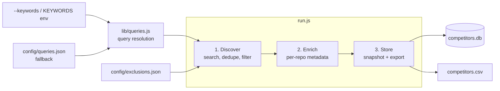

<div align="center">

# GitHub Prospecting

**Automated discovery and tracking of GitHub repositories in a target market.**

Search, enrich, snapshot. Watch a competitive landscape evolve over time and catch new entrants the day they appear.


</div>

---

## Table of contents

- [Overview](#overview)
- [How it works](#how-it-works)
- [Quick start](#quick-start)
- [Usage](#usage)
  - [Full pipeline](#full-pipeline)
  - [Fast mode](#fast-mode-discover-only)
- [Configuration](#configuration)
- [Data model](#data-model)
- [Project layout](#project-layout)
- [Rate limits](#rate-limits)
- [Troubleshooting](#troubleshooting)

## Overview

GitHub Prospecting is a small, dependency-light Node.js pipeline for competitive intelligence on GitHub. Point it at **any market segment** with `--keywords "your, terms"` — queries are generated automatically — or hand-tune a query list for precision (the repo ships with a tuned list targeting the **AI agent / LLM memory** space as a working example). Then run it on a schedule. Each run:

1. Discovers every public repository matching your queries
2. Enriches each candidate with deep metadata (activity, contributors, releases, README)
3. Persists a **dated snapshot** to SQLite and exports a star-ranked CSV

Because every run is a snapshot keyed by date, the database becomes a time series: you can chart star growth, spot momentum shifts, and get an explicit list of repos that are **new since the last run**.

**Design principles**

- **Config over code.** Retargeting to a different market is one `--keywords` flag; deeper tuning (queries, thresholds, exclusions) lives in three JSON files. Zero code changes either way.
- **Degrade, never abort.** A failed endpoint yields a `null` field, not a crashed run. Long runs survive rate limits by sleeping until the limit resets.
- **One dependency.** `better-sqlite3` for storage. Everything else is Node.js built-ins.

## How it works



| Stage | Module | What it does |
| --- | --- | --- |
| **Discover** | `lib/discover.js` | Resolves search queries via `lib/queries.js` (generated from `--keywords`, or `config/queries.json` when no keywords are given), runs each against the GitHub Search API, dedupes results by repository full name, drops repos listed in `config/exclusions.json`, and sorts by stars. A configurable delay between queries (longer when unauthenticated) stays within GitHub's search rate limits. |
| **Enrich** | `lib/enrich.js` | For each candidate, fetches full repository metadata, README, releases, contributors, language breakdown, weekly commit activity, and recent commits. Runs with bounded concurrency; any endpoint that fails yields `null` for that field rather than aborting the run. |
| **Store** | `lib/store.js` | Writes one snapshot per day into `competitors.db` and regenerates `competitors.csv` ranked by stars. Re-running on the same day overwrites that day's snapshot, so runs are idempotent. Also reports which repos are new since the last snapshot. |

Shared plumbing lives in `lib/github.js`: a thin GitHub REST client that adds auth headers, tracks request counts, retries on transient network errors, and automatically sleeps until `x-ratelimit-reset` when rate limited.

## Quick start

**Prerequisites:** Node.js 18 or newer (the pipeline uses the built-in `fetch`).

```bash
# 1. Install
npm install

# 2. Set a GitHub token (strongly recommended - see Rate limits below)
export GITHUB_TOKEN=ghp_xxx          # bash / zsh
$env:GITHUB_TOKEN = "ghp_xxx"        # PowerShell

# 3. Run the full pipeline against YOUR market
node run.js --keywords "vector database, embedding search"

# ...or run without --keywords to use the hand-tuned example queries
# (AI agent / LLM memory space) in config/queries.json
node run.js
```

No special token scopes are needed; a classic personal access token with public repository read access is enough. The pipeline runs unauthenticated too, just much more slowly.

## Usage

### Full pipeline

```bash
node run.js
```

Runs discover, enrich, and store in sequence. Produces or updates:

| Output | Description |
| --- | --- |
| `competitors.db` | SQLite database with one row per repo per snapshot date (`repos` table) plus full README text (`readmes` table) |
| `competitors.csv` | Star-ranked summary of the latest run, ready to open in a spreadsheet |

**Flags**

| Flag | Effect |
| --- | --- |
| `--keywords "kw1, kw2"` | Generate search queries from a comma-separated keyword list instead of using `config/queries.json`. Each keyword expands into a `topic:` query plus name/description matches. The `KEYWORDS` env var works too (the flag wins if both are set). |
| `--no-store` | Skip writing the database and CSV; print the enriched records as JSON to stdout instead |

```bash
# Pipe a snapshot into other tooling without touching the database
node run.js --no-store > snapshot.json
```

Progress logs and the end-of-run summary (repos discovered, API requests used, rate limit remaining, new repos since last snapshot) are printed to **stderr**, so stdout stays clean for JSON output and shell pipelines.

<details>
<summary><strong>Example run summary</strong></summary>

```text
=== run summary ===
snapshot date:        2026-07-09
discovered:           412
passed filters:       398
enriched:             395
new since last snap:  3
  + some-org/new-memory-layer
  + another/agent-recall
  + acme/context-store
  (review these for exclusions.json false positives)
API requests used:    2871
rate limit remaining: 2101
elapsed:              643.2s
output:               competitors.db, competitors.csv
```

</details>

### Fast mode (discover only)

```bash
node run-fast.js --keywords "vector database"   # keywords optional, as with run.js
```

Skips enrichment entirely and writes `competitors.csv` straight from the search results, which already carry stars, description, homepage, topics, and last-push date. Use fast mode when:

- You just want an up-to-date ranked list in a minute or two
- The candidate volume is large enough to trip GitHub's secondary rate limits during enrichment

## Configuration

There are two ways to define your prospecting space, and no code changes are needed to retarget the pipeline to a different market:

1. **Keywords (zero setup):** `node run.js --keywords "your, market, terms"` (or set the `KEYWORDS` env var). Each keyword is expanded into overlapping queries — a `topic:` search plus name and description matches — and results are deduplicated across them.
2. **Hand-tuned queries (max precision):** edit `config/queries.json`. Used whenever no keywords are given.

Tuning knobs and false-positive curation live in two more JSON files in `config/`.

### `config/queries.json` - what to search for

The list of GitHub search queries used when `--keywords` is not given. Any [GitHub repository search syntax](https://docs.github.com/en/search-github/searching-on-github/searching-for-repositories) works: topics, description matches, quoted phrases, qualifiers. The shipped list targets the AI agent / LLM memory space and doubles as an example of the pattern: start from keyword-generated queries, then graduate to a hand-tuned list once you know which shapes find your market.

```json
[
  "topic:agent-memory",
  "\"memory layer\" llm in:description",
  "\"long-term memory\" agent in:description"
]
```

> [!TIP]
> Cast a wide net with overlapping queries. Results are deduplicated across queries, and each stored record remembers which query first discovered it (`discovered_via_query`), which helps you evaluate query quality over time.

### `config/thresholds.json` - tuning knobs

Rate limiting, concurrency, and fetch-depth settings:

| Key | Default | Meaning |
| --- | --- | --- |
| `minStars` | `10` | Minimum star count (reserved; relevance filtering is currently disabled) |
| `maxMonthsSincePush` | `6` | Staleness cutoff (reserved; relevance filtering is currently disabled) |
| `searchPerPage` | `100` | Results fetched per search query |
| `searchDelayMsAuthed` | `2500` | Delay between search queries with a token |
| `searchDelayMsUnauthed` | `7000` | Delay between search queries without a token |
| `enrichConcurrency` | `5` | Repos enriched in parallel |
| `commitActivityMaxRetries` | `3` | Retries while GitHub computes commit stats (HTTP 202) |
| `commitActivityRetryDelayMs` | `2000` | Delay between those retries |
| `recentCommitsPerPage` | `20` | Recent commits captured per repo |
| `releasesPerPage` | `10` | Releases captured per repo |
| `contributorsPerPage` | `30` | Contributors captured per repo |

> [!NOTE]
> Automatic relevance filtering (stars/staleness) in `lib/discover.js` is currently disabled, so all discovered repos flow through for manual review. Curate the list with `exclusions.json` instead.

### `config/exclusions.json` - curated false positives

A map of `owner/repo` to a short reason, for repositories that match the queries but are not actually competitors (general agent frameworks, databases marketing to agent workloads, and so on). Excluded repos are dropped during the discover stage. The reasons are documentation for your future self. The shipped entries belong to the example agent-memory queries — when retargeting to your own market, start from `{}`.

```json
{
  "langchain-ai/langchain": "framework, memory is a submodule",
  "pingcap/tidb": "database marketing to agent workloads"
}
```

**Recommended workflow:** after each run, review the "new since last snapshot" list in the run summary and add any false positives here with a one-line reason.

## Data model

`competitors.db` contains two tables, both keyed by `(full_name, snapshot_date)`:

| Table | Contents |
| --- | --- |
| `repos` | One row per repo per snapshot: stars, forks, issues, watchers, topics, per-language byte counts, license, contributor counts, release info, weekly commit activity, recent commits, and the query that discovered it. Array and object fields are stored as JSON strings. |
| `readmes` | Full README markdown per repo per snapshot, kept in its own table so the main table stays light for querying. |

Because snapshots accumulate, longitudinal queries are trivial:

```sql
-- Star growth of one repo over time
SELECT snapshot_date, stargazers_count
FROM repos
WHERE full_name = 'some-org/some-repo'
ORDER BY snapshot_date;
```

```sql
-- Fastest-growing repos between the two most recent snapshots
WITH latest AS (SELECT MAX(snapshot_date) d FROM repos),
     prev   AS (SELECT MAX(snapshot_date) d FROM repos WHERE snapshot_date < (SELECT d FROM latest))
SELECT a.full_name,
       b.stargazers_count - a.stargazers_count AS stars_gained
FROM repos a
JOIN repos b ON b.full_name = a.full_name AND b.snapshot_date = (SELECT d FROM latest)
WHERE a.snapshot_date = (SELECT d FROM prev)
ORDER BY stars_gained DESC
LIMIT 20;
```

## Project layout

```text
github-prospecting/
├── run.js                  # Full pipeline entry point (discover -> enrich -> store)
├── run-fast.js             # Discover-only entry point (CSV straight from search)
├── lib/
│   ├── github.js           # Shared REST client: auth, rate limits, retries
│   ├── queries.js          # Query resolution: keywords -> queries, or queries.json
│   ├── discover.js         # Stage 1: search, dedupe, filter exclusions, sort
│   ├── enrich.js           # Stage 2: per-repo metadata fetch
│   └── store.js            # Stage 3: SQLite snapshot + CSV export
├── config/
│   ├── queries.json        # Search queries defining the space
│   ├── thresholds.json     # Rate limits and fetch-depth tuning
│   └── exclusions.json     # Known false positives, with reasons
├── competitors.db          # Generated: snapshot history (gitignored)
└── competitors.csv         # Generated: latest star-ranked summary (gitignored)
```

## Rate limits

GitHub's API limits are the main constraint on this pipeline, and it is built to respect them:

| | Authenticated | Unauthenticated |
| --- | --- | --- |
| Core API | 5,000 requests/hour | 60 requests/hour |
| Search API | 30 requests/minute | 10 requests/minute |

- **Always run with `GITHUB_TOKEN` set.** An unauthenticated full run is effectively impractical beyond a handful of repos.
- **Primary limits are handled automatically.** On a 403/429 the client sleeps until `x-ratelimit-reset` and retries, so long runs recover on their own.
- **Secondary (abuse) limits** can still trigger during enrichment at high candidate volume. If that happens, lower `enrichConcurrency` in `config/thresholds.json` or use `run-fast.js`.

## Troubleshooting

| Symptom | Likely cause | Fix |
| --- | --- | --- |
| Run is extremely slow, long pauses between queries | No `GITHUB_TOKEN` set | Export a token; authenticated search delay drops from 7s to 2.5s per query |
| Repeated `rate limited on ...` messages during enrichment | GitHub secondary rate limit | Lower `enrichConcurrency`, or switch to `node run-fast.js` |
| `weekly_commits` is `null` for some repos | GitHub returns 202 while computing stats and retries were exhausted | Re-run later; stats are usually cached by GitHub after the first request |
| `skipping <repo>: repo metadata fetch failed` | Repo was deleted or made private between discovery and enrichment | Expected; the repo is dropped from the snapshot |
| A repo you know is irrelevant keeps appearing | It matches a query | Add it to `config/exclusions.json` with a reason |
